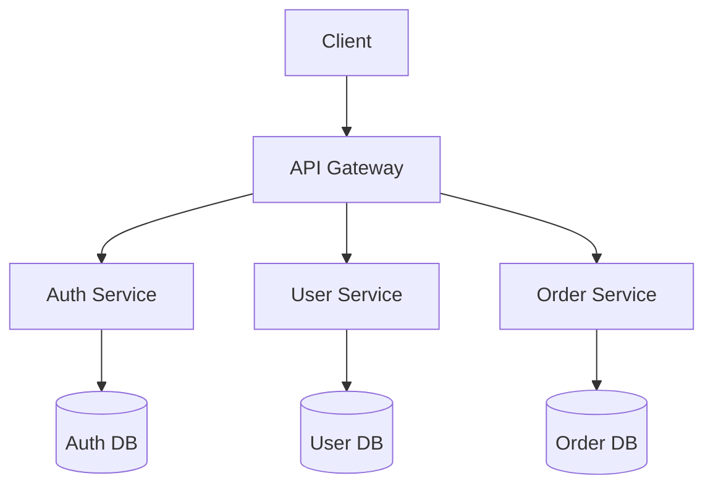

# Slides - Système de présentation

## 🎯 Objectif

Ce projet répond au besoin de garder un contrôle total sur mes présentations en local, avec une customisation complète et une organisation structurée par sujets.

Basé sur [Slidev](https://github.com/slidevjs/slidev), il permet de créer des slides modernes avec du code, des diagrammes et des animations.

## 📁 Architecture

```
slides/
├── .env                    # Configuration environnement
├── .gitignore              # Fichiers à ignorer par Git
├── vite.config.ts          # Configuration Vite + Slidev
├── ecosystem.config.cjs    # Configuration PM2 pour prod et drafts
├── package.json            # Dépendances et scripts
├── slides.md               # Présentation principale
├── pages/                  # Slides organisés par sujet
│   ├── web-development/    # Catégorie développement web
│   │   ├── javascript.md
│   │   └── vue-framework.md
│   ├── devops/            # Catégorie DevOps
│   │   ├── docker.md
│   │   └── kubernetes.md
│   └── presentations/     # Présentations diverses
│       ├── project-demo.md
│       └── team-meeting.md
├── components/            # Composants Vue réutilisables
│   ├── Counter.vue
│   ├── CodeBlock.vue      # Bloc de code personnalisé
│   └── ImageGallery.vue   # Galerie d'images
├── snippets/              # Extraits de code
│   ├── external.ts
│   ├── javascript/        # Snippets JavaScript
│   │   ├── async-await.js
│   │   └── promises.js
│   └── css/              # Snippets CSS
│       └── animations.css
├── dist/               # Build de production (généré)
└── node_modules/       # Dépendances (généré)
```

## 🚀 Démarrage Rapide

### Installation

```bash
npm install
```

### Développement

```bash
npm run dev
# Accès: http://127.0.0.1:3030
```

### Build Production

```bash
npm run build
```

### Export

#### PDF (par défaut)

```bash
npm run export
# ou explicitement
slidev export --format pdf
```

#### PNG (images)

```bash
slidev export --format png
```

#### PowerPoint (PPTX)

```bash
slidev export --format pptx
```

#### Options d'export avancées

```bash
# Export avec thème sombre
slidev export --dark

# Export avec timeout personnalisé
slidev export --timeout 30000

# Export avec résolution spécifique
slidev export --width 1920 --height 1080

# Export d'une plage de slides
slidev export --range 1,3-5,8
```

## ⚙️ Configuration

### Variables d'environnement (.env)

```env
VITE_HOST=127.0.0.1
VITE_PORT=3032
VITE_ALLOWED_HOSTS=drafts.slides.bastou.dev
```

### Différences Draft vs Production

#### Package.json

- **Draft**: `"dev": "slidev --remote --port=3032"`
- **Production**: Port et host configurés via `.env`

#### Ecosystem PM2

- **Draft**: Utilise le script `npm run dev`
- **Production**: Devrait utiliser `npm run build` + serveur statique

#### Vite.config.ts

Configuration fusionnée avec Slidev pour:

- Host/Port personnalisables via `.env`
- Hosts autorisés pour accès distant
- Intégration transparente avec la config Slidev

## 📚 Organisation des Contenus

### Structure par Catégories

Organisez vos slides par domaines thématiques pour une navigation intuitive :

```
pages/
├── web-development/           # Développement web
│   ├── javascript-basics.md   # Les bases JavaScript
│   ├── vue-advanced.md        # Vue.js avancé
│   ├── css-grid.md           # CSS Grid Layout
│   └── performance-web.md     # Optimisation performance
├── devops/                   # DevOps et infrastructure
│   ├── docker-intro.md       # Introduction Docker
│   ├── kubernetes.md         # Orchestration K8s
│   ├── ci-cd-pipeline.md     # Pipelines CI/CD
│   └── monitoring.md         # Surveillance système
├── presentations/            # Présentations business
│   ├── project-demo.md       # Démo de projet
│   ├── team-meeting.md       # Réunion équipe
│   └── client-pitch.md       # Présentation client
├── tutorials/               # Tutoriels techniques
│   ├── git-workflow.md      # Workflow Git
│   └── api-design.md        # Conception d'API
└── workshops/              # Ateliers et formations
    ├── code-review.md      # Revue de code
    └── security-basics.md  # Sécurité de base
```

### Conventions de Nommage

- **Fichiers** : `kebab-case.md` (ex: `javascript-basics.md`)
- **Dossiers** : `kebab-case` (ex: `web-development/`)
- **Titres** : Descriptifs et explicites
- **Ordre** : Préfixer par numéro si séquence logique (`01-intro.md`, `02-setup.md`)

## 🛠️ Fonctionnalités

### Création de Contenu
- **Slides en Markdown** avec syntaxe étendue
- **Composants Vue** intégrés et réutilisables
- **Code highlighting** avec Shiki (100+ langages)
- **Diagrammes** Mermaid, PlantUML intégrés
- **Formules mathématiques** avec KaTeX
- **Icônes** avec Iconify (100k+ icônes)

### Présentation
- **Mode présentateur** avec notes privées
- **Animations** et transitions fluides
- **Navigation** clavier et souris
- **Timer** et chronomètre intégrés
- **Mode sombre/clair** automatique
- **Responsive** pour tous écrans

### Export et Partage
- **Export PDF** haute qualité
- **Export PNG** (slides individuelles)
- **Export PowerPoint** (PPTX)
- **Mode SPA** pour hébergement web
- **Enregistrement** de présentation

### Développement
- **Hot reload** en temps réel
- **TypeScript** support complet
- **Thèmes** personnalisables
- **Plugins** extensibles
- **Intégration** Git native

## Exemples Pratiques

### Slide avec Code Interactif

```markdown
---
layout: two-cols
---

# Exemple JavaScript

<template v-slot:default>

```js {2-4|5-7|all}
function fibonacci(n) {
  if (n <= 1) return n
  return fibonacci(n - 1) + fibonacci(n - 2)
}

const result = fibonacci(10)
console.log(result) // 55
```

</template>
<template v-slot:right>

- Fonction récursive
- Complexité O(2^n)
- Optimisation possible avec mémoïsation

<Counter :count="10" />

</template>
```

### Slide avec Diagramme

```markdown
---
layout: center
---

# Architecture Microservices



### Slide avec Formule Mathématique

```markdown
---
layout: statement
---

# Théorème de Pythagore

$$
a^2 + b^2 = c^2
$$

Où $c$ est l'hypoténuse d'un triangle rectangle.
```

### Composant Vue Personnalisé

```vue
<!-- components/ProgressBar.vue -->
<template>
  <div class="progress-container">
    <div 
      class="progress-bar" 
      :style="{ width: `${progress}%` }"
    ></div>
    <span class="progress-text">{{ progress }}%</span>
  </div>
</template>

<script setup>
defineProps({
  progress: {
    type: Number,
    default: 0
  }
})
</script>
```

### Configuration de Thème

```css
/* styles/themes/corporate.css */
:root {
  --slidev-theme-primary: #2563eb;
  --slidev-theme-secondary: #64748b;
  --slidev-code-background: #1e293b;
  --slidev-code-foreground: #e2e8f0;
}

.slidev-layout {
  background: linear-gradient(135deg, #667eea 0%, #764ba2 100%);
}
```

## 🎨 Personnalisation Avancée

### Layouts Personnalisés

Créez des layouts dans `layouts/` :

```vue
<!-- layouts/custom-intro.vue -->
<template>
  <div class="custom-intro">
    <div class="hero-section">
      <h1><slot /></h1>
    </div>
    <div class="subtitle-section">
      <slot name="subtitle" />
    </div>
  </div>
</template>
```

### Shortcuts Clavier

Ajoutez des raccourcis dans `setup/shortcuts.ts` :

```ts
import { defineShortcutsSetup } from '@slidev/types'

export default defineShortcutsSetup((nav, base) => {
  return [
    ...base,
    {
      key: 'enter',
      fn: () => nav.next(),
      autoRepeat: true,
    },
    {
      key: 'backspace',
      fn: () => nav.prev(),
      autoRepeat: true,
    }
  ]
})
```

## 📖 Ressources

### Documentation Officielle
- [Documentation Slidev](https://sli.dev)
- [Guide de démarrage](https://sli.dev/guide/)

### Thèmes et Extensions
- [Galerie de thèmes](https://sli.dev/resources/theme-gallery)
- [Composants intégrés](https://sli.dev/guide/component)
- [Addons communautaires](https://sli.dev/guide/theme-addon#use-addon)

### Communauté
- [GitHub Discussions](https://github.com/slidevjs/slidev/discussions)
- [Discord](https://chat.sli.dev)
- [Exemples de présentations](https://github.com/slidevjs/slidev/tree/main/demo)
