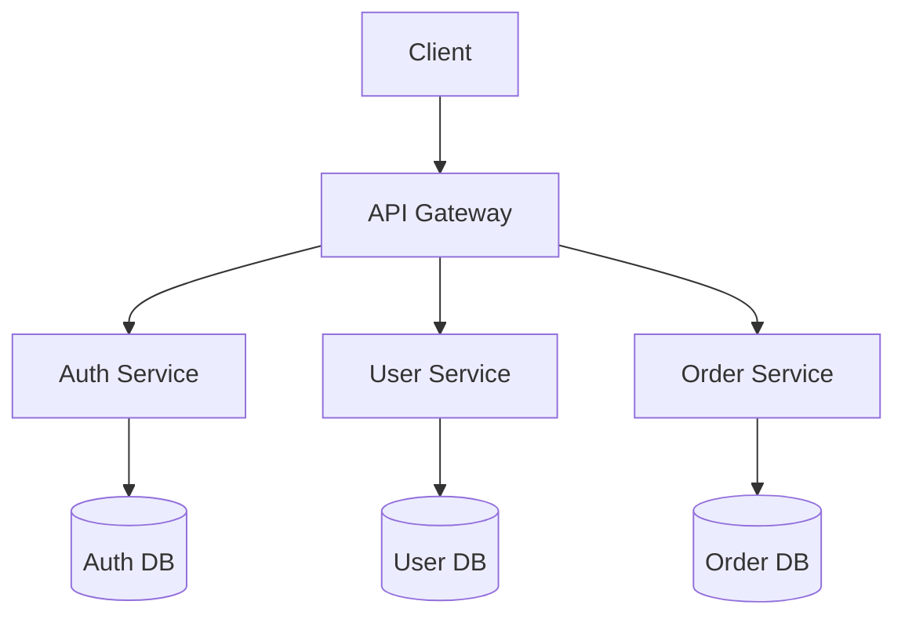

# Slides - Système de présentation

## 🎯 Objectif

Ce projet répond au besoin de garder un contrôle total sur mes présentations en local, avec une customisation complète et une organisation structurée par sujets.

Basé sur [Slidev](https://github.com/slidevjs/slidev), il permet de créer des slides modernes avec du code, des diagrammes et des animations.

## 📁 Architecture

```
slides/
├── .env                    # Configuration environnement
├── .gitignore              # Fichiers à ignorer par Git
├── ecosystem.config.cjs    # Configuration PM2 pour prod et drafts
├── package.json            # Dépendances et scripts
├── pages/                  # Slides organisés par sujet
│   ├── bastaverse/         # Présentation BastaVerse
│   │   ├── assets/{images} # Assets de la présentation
│   │   └── main.md
│   └── tribu/            # Présentation Tribu
│       ├── assets/{images} # Assets de la présentation
│       └── main.md
├── components/            # Composants Vue réutilisables
│   ├── Counter.vue
│   ├── CodeBlock.vue      # Bloc de code personnalisé
│   └── ImageGallery.vue   # Galerie d'images
├── snippets/              # Extraits de code
│   ├── external.ts
│   ├── javascript/        # Snippets JavaScript
│   │   ├── async-await.js
│   │   └── promises.js
│   └── css/              # Snippets CSS
│       └── animations.css
├── dist/               # Build de production (généré)
└── node_modules/       # Dépendances (généré)
```

## 🚀 Démarrage Rapide

### Installation & Développement

```bash
# Installation
npm install

# Développement pour un projet spécifique
npm run dev bastaverse    # Accès: https://drafts.slides-dev.bastou.dev/
npm run dev tribu         # Accès: https://drafts.slides-dev.bastou.dev/

# Build de production
npm run build:all         # Build toutes les présentations
npm run build:bastaverse  # Build spécifique
npm run build:tribu       # Build spécifique
```

## 📂 Split de Projets

Ce projet utilise une architecture multi-présentations avec des builds séparés :

### Structure des Présentations

```
pages/
├── bastaverse/           # Présentation BastaVerse
│   └── slides.md         # Contenu de la présentation
└── tribu/               # Présentation Tribu
    └── slides.md         # Contenu de la présentation
```

### Builds Séparés

Chaque présentation génère son propre build dans `dist/` :

```
dist/
├── bastaverse/          # Build de la présentation BastaVerse
│   ├── index.html
│   ├── assets/
│   └── ...
└── tribu/              # Build de la présentation Tribu
    ├── index.html
    ├── assets/
    └── ...
```

### Scripts de Build

```bash
# Build toutes les présentations
npm run build:all

# Build spécifique (si configuré)
npm run build:bastaverse
npm run build:tribu
```

### Export

#### PDF (par défaut)

```bash
npm run export
# ou explicitement
slidev export --format pdf
```

#### PNG (images)

```bash
slidev export --format png
```

#### PowerPoint (PPTX)

```bash
slidev export --format pptx
```

#### Options d'export avancées

```bash
# Export avec thème sombre
slidev export --dark

# Export avec timeout personnalisé
slidev export --timeout 30000

# Export avec résolution spécifique
slidev export --width 1920 --height 1080

# Export d'une plage de slides
slidev export --range 1,3-5,8
```

## ⚙️ Configuration

### Variables d'environnement (.env)

```env
VITE_HOST=127.0.0.1
VITE_PORT=3032
VITE_ALLOWED_HOSTS=drafts.slides.bastou.dev
```

### Différences Draft vs Production

#### Package.json

- **Draft**: `"dev": "slidev --remote --port=3032"`
- **Production**: Port et host configurés via `.env`

#### Ecosystem PM2

- **Draft**: Utilise le script `npm run dev`
- **Production**: Devrait utiliser `npm run build` + serveur statique

#### Vite.config.ts

Configuration fusionnée avec Slidev pour:

- Host/Port personnalisables via `.env`
- Hosts autorisés pour accès distant
- Intégration transparente avec la config Slidev

## 🌐 Configuration Nginx Proxy Manager

### Domaines et Proxy Hosts

Le projet utilise deux domaines distincts :

#### 1. Développement : `drafts.slides-dev.bastou.dev`
- **Proxy Host** : `127.0.0.1:3032`
- **Usage** : Serveur de développement Slidev avec hot-reload
- **Accès** : `https://drafts.slides-dev.bastou.dev/`

#### 2. Production : `drafts.slides.bastou.dev`
- **Proxy Host** : `127.0.0.1:80`
- **Usage** : Fichiers statiques buildés
- **Configuration locations** :

```nginx
# Page d'accueil
location / {
    root /sites/drafts/slides;
    index index.html;
    try_files $uri $uri/ =404;
}

# Pour la présentation bastaverse
location /bastaverse/ {
    alias /sites/drafts/slides/dist/bastaverse/;
    try_files $uri $uri/ /bastaverse/index.html;
}

# Pour la présentation tribu
location /tribu/ {
    alias /sites/drafts/slides/dist/tribu/;
    try_files $uri $uri/ /tribu/index.html;
}
```

### Accès aux Présentations

#### Développement (avec hot-reload)
- **Développement** : `https://drafts.slides-dev.bastou.dev/`

#### Production (fichiers statiques)
- **BastaVerse** : `https://drafts.slides.bastou.dev/bastaverse/`
- **Tribu** : `https://drafts.slides.bastou.dev/tribu/`

### Configuration PM2

Le projet utilise PM2 pour la gestion des processus :

```javascript
// ecosystem.config.cjs
module.exports = {
  apps: [
    {
      name: "drafts.slides",
      script: "npm",
      args: "run dev",
      cwd: "/sites/drafts/slides",
      env: {
        NODE_ENV: "development",
        VITE_HOST: "127.0.0.1",
        VITE_PORT: "3032",
      },
    },
  ],
};
```

## 📚 Organisation des Contenus

### Structure par Catégories

Organisez vos slides par domaines thématiques pour une navigation intuitive :

```
pages/
├── bastaverse/            # Présentation BastaVerse
│   └── main.md            # Présentation de l'écosystème BastaVerse
├── tribu/                 # Présentation Tribu
│   └── main.md            # Présentation pour l'équipe Tribu
```

### Présentations Actives

- **BastaVerse** : Présentation de l'écosystème et de l'architecture des projets
- **Tribu** : Présentation dédiée à l'équipe et aux processus collaboratifs

### Conventions de Nommage

- **Fichiers** : `kebab-case.md` (ex: `javascript-basics.md`)
- **Dossiers** : `kebab-case` (ex: `web-development/`)
- **Titres** : Descriptifs et explicites
- **Ordre** : Préfixer par numéro si séquence logique (`01-intro.md`, `02-setup.md`)

## 🛠️ Fonctionnalités

### Création de Contenu

- **Slides en Markdown** avec syntaxe étendue
- **Composants Vue** intégrés et réutilisables
- **Code highlighting** avec Shiki (100+ langages)
- **Diagrammes** Mermaid, PlantUML intégrés
- **Formules mathématiques** avec KaTeX
- **Icônes** avec Iconify (100k+ icônes)

### Présentation

- **Mode présentateur** avec notes privées
- **Animations** et transitions fluides
- **Navigation** clavier et souris
- **Timer** et chronomètre intégrés
- **Mode sombre/clair** automatique
- **Responsive** pour tous écrans

### Export et Partage

- **Export PDF** haute qualité
- **Export PNG** (slides individuelles)
- **Export PowerPoint** (PPTX)
- **Mode SPA** pour hébergement web
- **Enregistrement** de présentation

### Développement

- **Hot reload** en temps réel
- **TypeScript** support complet
- **Thèmes** personnalisables
- **Plugins** extensibles
- **Intégration** Git native

## Exemples Pratiques

### Slide avec Code Interactif

````markdown
---
layout: two-cols
---

# Exemple JavaScript

<template v-slot:default>

```js {2-4|5-7|all}
function fibonacci(n) {
  if (n <= 1) return n;
  return fibonacci(n - 1) + fibonacci(n - 2);
}

const result = fibonacci(10);
console.log(result); // 55
```
````

</template>
<template v-slot:right>

- Fonction récursive
- Complexité O(2^n)
- Optimisation possible avec mémoïsation

<Counter :count="10" />

</template>
```

### Slide avec Diagramme

````markdown
---
layout: center
---

# Architecture Microservices


````

### Slide avec Formule Mathématique

```markdown
---
layout: statement
---

# Théorème de Pythagore

$$
a^2 + b^2 = c^2
$$

Où $c$ est l'hypoténuse d'un triangle rectangle.
```

### Composant Vue Personnalisé

```vue
<!-- components/ProgressBar.vue -->
<template>
  <div class="progress-container">
    <div class="progress-bar" :style="{ width: `${progress}%` }"></div>
    <span class="progress-text">{{ progress }}%</span>
  </div>
</template>

<script setup>
defineProps({
  progress: {
    type: Number,
    default: 0,
  },
});
</script>
```

### Configuration de Thème

```css
/* styles/themes/corporate.css */
:root {
  --slidev-theme-primary: #2563eb;
  --slidev-theme-secondary: #64748b;
  --slidev-code-background: #1e293b;
  --slidev-code-foreground: #e2e8f0;
}

.slidev-layout {
  background: linear-gradient(135deg, #667eea 0%, #764ba2 100%);
}
```

## 🎨 Personnalisation Avancée

### Layouts Personnalisés

Créez des layouts dans `layouts/` :

```vue
<!-- layouts/custom-intro.vue -->
<template>
  <div class="custom-intro">
    <div class="hero-section">
      <h1><slot /></h1>
    </div>
    <div class="subtitle-section">
      <slot name="subtitle" />
    </div>
  </div>
</template>
```

### Shortcuts Clavier

Ajoutez des raccourcis dans `setup/shortcuts.ts` :

```ts
import { defineShortcutsSetup } from "@slidev/types";

export default defineShortcutsSetup((nav, base) => {
  return [
    ...base,
    {
      key: "enter",
      fn: () => nav.next(),
      autoRepeat: true,
    },
    {
      key: "backspace",
      fn: () => nav.prev(),
      autoRepeat: true,
    },
  ];
});
```

## 📖 Ressources

### Documentation Officielle

- [Documentation Slidev](https://sli.dev)
- [Guide de démarrage](https://sli.dev/guide/)

### Thèmes et Extensions

- [Galerie de thèmes](https://sli.dev/resources/theme-gallery)
- [Composants intégrés](https://sli.dev/guide/component)
- [Addons communautaires](https://sli.dev/guide/theme-addon#use-addon)

### Communauté

- [GitHub Discussions](https://github.com/slidevjs/slidev/discussions)
- [Discord](https://chat.sli.dev)
- [Exemples de présentations](https://github.com/slidevjs/slidev/tree/main/demo)
