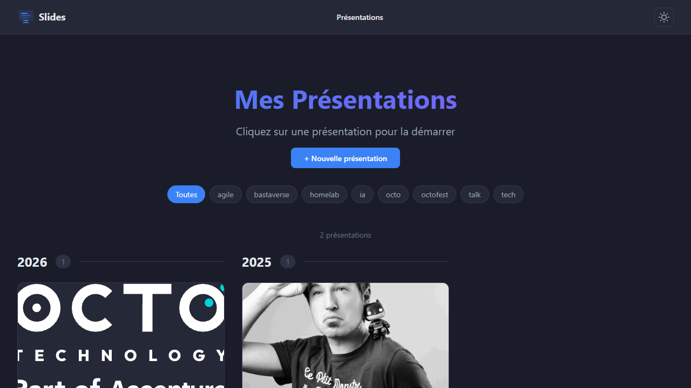
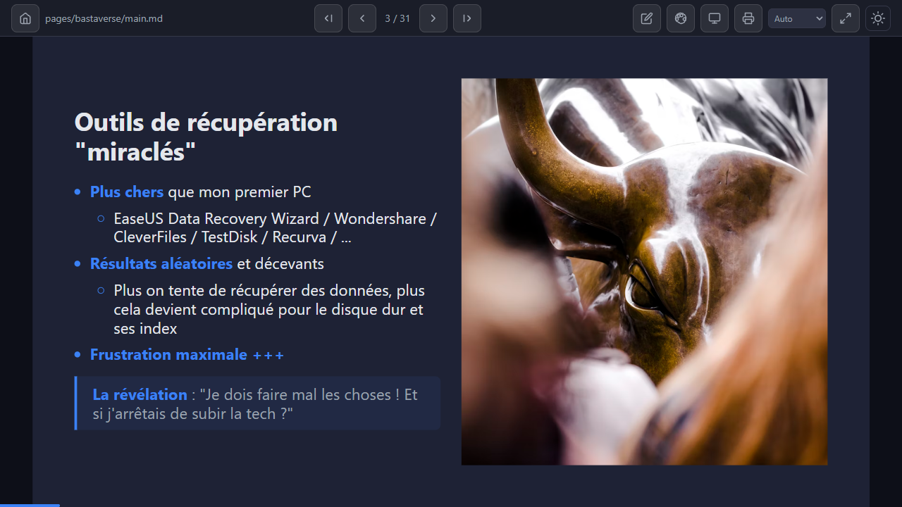

# Slides - Système de présentation





## 🎯 Objectif

Ce projet répond au besoin de garder un contrôle total sur mes présentations en local, avec une customisation complète et une organisation structurée par sujets.

## 🚀 Démarrage Rapide

### Installation & Développement

```bash
# Installation
npm install

# Build de production
npm run build:all                 # Build toutes les présentations
npm run build:bastaverse          # Build spécifique
npm run build:autre-presentation  # Build spécifique
```

## 📂 Split de Projets

Ce projet utilise une architecture multi-présentations avec des builds séparés :

### Structure des Présentations

```
pages/
├── bastaverse/           # Présentation BastaVerse
│   └── slides.md         # Contenu de la présentation
└── autre-presentation/   # Présentation autre-presentation
    └── slides.md         # Contenu de la présentation avec possibilité d'avoir d'autres slides
```

### Builds Séparés

Chaque présentation génère son propre build dans `dist/` :

```
dist/
├── bastaverse/          # Build de la présentation BastaVerse
│   ├── index.html
│   ├── assets/
│   └── ...
└── autre-presentation/              # Build de la présentation autre-presentation
    ├── index.html
    ├── assets/
    └── ...
```

### Scripts de Build

```bash
# Build toutes les présentations
npm run build:all

# Build spécifique (si configuré)
npm run build:bastaverse
npm run build:autre-presentation
```

### Export

#### PDF (par défaut)

#### PNG (images)

#### PowerPoint (PPTX)

### Accès aux Présentations

#### Affichages
- **BastaVerse** : `https://slides-drafts.bastou.dev/viewer.html?file=pages/bastaverse/main.md`
- **Octo** : `https://slides-drafts.bastou.dev/viewer.html?file=pages/octo/main.md`

---

## 📚 Organisation des contenus

### Structure par Catégories

Organisez vos slides par domaines thématiques pour une navigation intuitive :

```
pages/
├── bastaverse/            # Présentation BastaVerse
│   └── main.md            # Présentation de l'écosystème BastaVerse
├── autre-presentation/    # Présentation autre-presentation
│   └── images/            # Images
│   └── main.md            # Présentation pour l'équipe autre-presentation
```


### Conventions de Nommage

- **Fichiers** : `kebab-case.md` (ex: `javascript-basics.md`)
- **Dossiers** : `kebab-case` (ex: `web-development/`)
- **Titres** : Descriptifs et explicites
- **Ordre** : Préfixer par numéro si séquence logique (`01-intro.md`, `02-setup.md`)

## 🛠️ Fonctionnalités

### Création de Contenu

- **Slides en Markdown** avec syntaxe étendue
- **Diagrammes** Mermaid, PlantUML intégrés
- **Formules mathématiques** avec KaTeX
- **Icônes** avec Iconify (100k+ icônes)

### Présentation

- **Mode présentateur** avec notes privées
- **Animations** et transitions fluides (paramétrables)
- **Navigation** clavier et souris
- **Timer** et chronomètre intégrés
- **Mode sombre/clair** automatique
- **Responsive** pour tous écrans

### Export et Partage

- **Export PDF** haute qualité
- **Export PNG** (slides individuelles)
- **Export PowerPoint** (PPTX)
- **Mode SPA** pour hébergement web
- **Enregistrement** de présentation

### Développement

- **Hot reload** en temps réel
- **TypeScript** support complet
- **Thèmes** personnalisables
- **Plugins** extensibles
- **Intégration** Git native

### Configuration de thème

```css
/* styles/themes/corporate.css */
:root {
  --slidev-theme-primary: #2563eb;
  --slidev-theme-secondary: #64748b;
  --slidev-code-background: #1e293b;
  --slidev-code-foreground: #e2e8f0;
}

.layout {
  background: linear-gradient(135deg, #667eea 0%, #764ba2 100%);
}
```

## 🎨 Personnalisation Avancée

### Layouts Personnalisés

### Shortcuts Clavier

## 🙏 Remerciements

Basé sur [Slidev](https://github.com/slidevjs/slidev), il permet de créer des slides modernes avec du code, des diagrammes et des animations.

## 📖 Ressources
