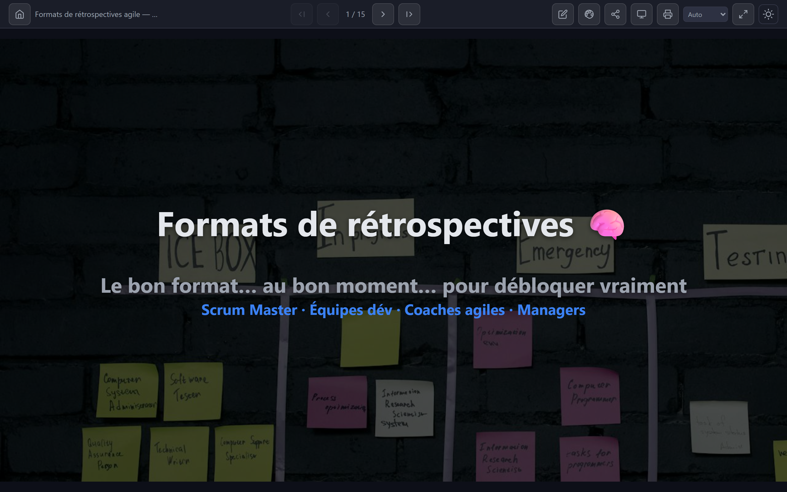

# Slides — Moteur de présentation BastaVerse

Moteur de présentation vanilla JS qui rend des fichiers Markdown en slideshows interactifs. Pas de build step, pas de framework, pas de npm.

## Démarrage rapide

```bash
# Depuis la racine BastaVerse
pm2 start drafts.api
# Ouvrir https://slides-drafts.bastou.dev
```

## Structure

```
slides/
├── index.html                  # Listing des présentations (grille, filtres tags)
├── viewer.html                 # Lecteur plein écran 16:9 avec éditeur intégré
├── presenter.html              # Vue présentateur (notes + minuterie)
├── config/
│   └── presentations.json      # Registre des présentations (source de vérité)
├── pages/{id}/
│   ├── main.md                 # Contenu Markdown de la présentation
│   └── images/                 # Images propres à la présentation
├── assets/
│   ├── css/                    # Feuilles de style (composants + modules)
│   ├── js/
│   │   ├── slide-engine.js     # Parsing, rendu, navigation, hash URL
│   │   ├── slide-editor.js     # Éditeur Markdown inline + refresh image
│   │   ├── slide-drag-position.js  # Repositionnement des blocs
│   │   ├── ai-slides.js        # Panneau de modification IA
│   │   ├── theme-manager.js    # Thèmes visuels
│   │   └── main.js             # Page d'accueil
│   └── images/
├── api/routes/
│   ├── routes-editor.js        # Sauvegarde/chargement Markdown
│   └── routes-ai-slides.js     # Génération IA, recherche Pexels
└── themes/                     # CSS des thèmes visuels
```

## Ajouter une présentation

1. Créer `pages/{id}/main.md`
2. Ajouter l'entrée dans `config/presentations.json` :

```json
{
  "id": "mon-talk",
  "title": "Mon Talk",
  "author": "Prénom Nom",
  "date": "2026-04-24",
  "tags": ["agile", "retro"],
  "file": "pages/mon-talk/main.md",
  "thumbnail": "pages/mon-talk/images/thumb.jpg"
}
```

3. La présentation apparaît sur la page d'accueil groupée par année.

## Format Markdown

```markdown
---
title: Titre de la présentation
author: Nom de l'auteur
date: 2026-04-24
---

# Première slide (titre)

Contenu ici

<!-- notes
Notes du présentateur (uniquement visibles dans la vue présentateur)
-->

---

## Deuxième slide

- Point 1
- Point 2

---

<!-- layout: image-right -->

## Slide avec image

Texte à gauche


```

- Séparateur de slides : `\n---\n`
- Frontmatter YAML : `title`, `author`, `date`
- Notes : `<!-- notes\n...\n-->`
- Diagrammes : ` ```mermaid `
- Formules : `$inline$` ou `$$display$$`

## Layouts

| Directive | Effet |
|-----------|-------|
| *(auto)* | `title` si 1ère slide, `section` si slide courte |
| `<!-- layout: content -->` | Colonne par défaut |
| `<!-- layout: image-right -->` | Texte gauche, image droite |
| `<!-- layout: image-left -->` | Image gauche, texte droite |
| `<!-- layout: cover -->` | Image `` en fond plein écran |
| `<!-- layout: image -->` | Image `` en fond (contain) |
| `<!-- class: ma-classe -->` | Classes CSS sur la slide |
| `<!-- style: background: red -->` | CSS inline sur la slide |

Image de fond : `` — l'alt `bg` déclenche le mode fond.

## URLs

Format de lien direct vers une slide :

```
viewer.html#{date}-{id}:{slide-slug}
# exemple :
viewer.html#2026-04-24-mon-talk:une-slide-titre
```

- `{date}-{id}` : identifie la présentation
- `:{slide-slug}` : slug généré depuis le titre `#` de la slide (optionnel, navigue au numéro si absent)
- Bouton de partage dans la toolbar : copie l'URL courante dans le presse-papiers

## Raccourcis clavier (viewer)

| Touche | Action |
|--------|--------|
| → / ↓ / Espace | Slide suivante |
| ← / ↑ | Slide précédente |
| Home | Première slide |
| End | Dernière slide |
| F | Plein écran |
| P | Vue présentateur |
| S | Style picker (thème visuel) |
| E | Éditeur Markdown |
| Escape | Fermer panneau/plein écran |

## Éditeur Markdown

Accessible via `E` ou le bouton crayon dans la toolbar :
- Split view : textarea (gauche) + preview temps réel (droite)
- `Ctrl+S` sauvegarde via `POST /api/routes-editor/save`
- Navigation entre slides préserve le contexte d'édition

### Refresh image

Bouton dans la toolbar (icône rafraîchissement) :
- **0 image** dans la slide : insère `` et place le curseur sur le texte alt
- **1 image** : remplace directement l'URL via Pexels (recherche par texte alt)
- **2+ images** : affiche un sélecteur flottant pour choisir l'image à remplacer
- Bouton secondaire sur le bloc image (au survol) : `refreshImageByAlt(alt)`
- Recherche Pexels : `GET /api/routes-ai-slides/image-search?q=keywords`
- Tailles : `urlBg` = `p.src.original` (fond plein, sans limite), `url` = `p.src.large2x` (1880px, contenu)

## Modification IA des slides

Bouton étoile dans la toolbar du viewer :
- Textarea : description de la modification souhaitée
- Layout : choix du layout cible
- Image : picker visuel (bouton Pexels / Galerie quand vide, miniature + Changer / Effacer quand rempli)
- Modèle : sélection du modèle Claude
- `POST /api/routes-ai-slides/generate-and-create` : génère le Markdown et crée la présentation

La réponse IA doit commencer par `DESCRIPTION: phrase courte` (extraite pour le frontmatter).

## Thèmes visuels

Bouton palette (`S`) dans la toolbar :
- 5 presets : Sombre (défaut), Clair, Océan, Sunset, Forêt
- Fine-tuning : couleur d'accent, police (system / serif / mono)
- Persistance `localStorage` (clé `slides-slide-theme`)

## API Backend

| Route | Description |
|-------|-------------|
| `GET /api/routes-editor/load?file=pages/{id}/main.md` | Charge le Markdown |
| `POST /api/routes-editor/save` | Sauvegarde le Markdown |
| `GET /api/routes-ai-slides/image-search?q=keywords` | Recherche Pexels (retourne `{url, urlBg, alt}`) |
| `POST /api/routes-ai-slides/generate-and-create` | Génère une présentation via Claude |

Sources des routes : `slides/api/routes/` (sync auto vers `api-multi-sites/data/slides/`)

## Bibliothèques CDN

- **marked.js** v15 — Parser Markdown
- **marked-highlight** v2 — Coloration syntaxique via highlight.js
- **highlight.js** v11 + github-dark
- **DOMPurify** v3.2 — Sanitisation XSS (`innerHTML` uniquement après `sanitize()`)
- **KaTeX** v0.16 — Formules mathématiques
- **Mermaid** v11 (ESM) — Diagrammes

## Aperçu

### Homepage — Liste des présentations


### Viewer — Slide de présentation


