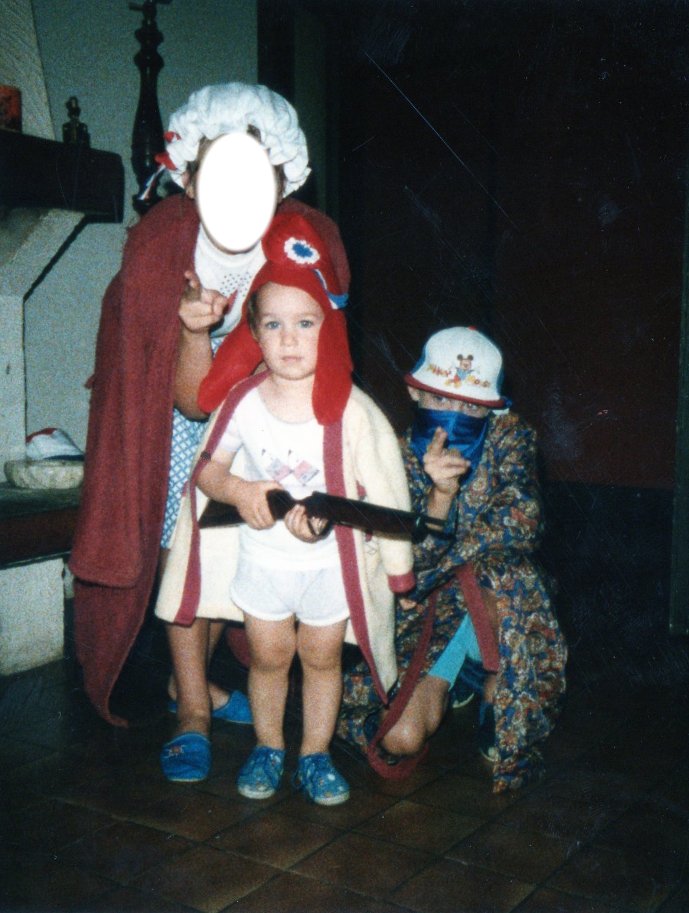

# 💥 LE DELIC QUI CHANGE TOUT

### Il y a quelques années

<v-clicks>

- **des centaines** de photos de famille... 😱
- Des **mois** de galère pour récupérer
- Stress intense dans le foyer
- Tristesse > Colère > Fatigue > Frustration > Résignation...

</v-clicks>

 

<v-click>

# **"Plus jamais ça !"** 🤬

  

</v-click>

<!--
Imaginez perdre des années de souvenirs d'un coup... C'est exactement ce qui m'est arrivé !
Toutes mes vacances depuis 20 ans.
-->

---
layout: image-left
class: text-right
image: https://images.unsplash.com/photo-1553316045-e56f8b09f0ed?q=80&w=774&auto=format&fit=crop&ixlib=rb-4.1.0&ixid=M3wxMjA3fDB8MHxwaG90by1wYWdlfHx8fGVufDB8fHx8fA%3D%3D
---

🛠️ Outils de récupération "miracles"

<v-clicks>

    
💸 <strong>Plus chers</strong> que mon premier PC

    
EaseUS Data Recovery Wizard / Wondershare / CleverFiles / TestDisk / Recurva / ...

</v-clicks>

<v-clicks>

    

    
🎲 <strong>Résultats aléatoires</strong> et décevants :

    
Plus on tente de récupérer des données, plus cela devient compliqué pour le disque dur et ses index

</v-clicks>

<v-clicks>

    

    
😤 <strong>Frustration maximale +++</strong>

</v-clicks>

<v-click>

  

    

      <svg class="w-5 h-5 text-blue-500 mt-0.5" fill="currentColor" viewBox="0 0 20 20">
        <path fill-rule="evenodd" d="M18 10a8 8 0 11-16 0 8 8 0 0116 0zm-7-4a1 1 0 11-2 0 1 1 0 012 0zM9 9a1 1 0 000 2v3a1 1 0 001 1h1a1 1 0 100-2v-3a1 1 0 00-1-1H9z" clip-rule="evenodd"></path>
      </svg>
    

    

      <h3 class="font-semibold text-blue-800">💡 La révélation</h3>
      "Je dois faire mal les choses ! Et si j'arrêtais de subir la tech ?"
    

  

</v-click>

<!--
J'ai testé tous ces outils coûteux sans succès. Plus on essaie de récupérer, plus on risque d'endommager définitivement les données.
C'est le moment où j'ai réalisé qu'il fallait changer d'approche !
-->
