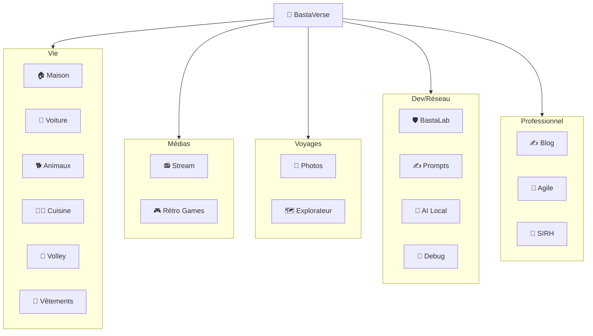
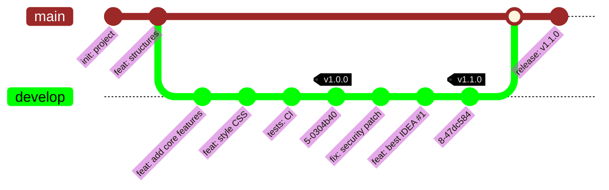
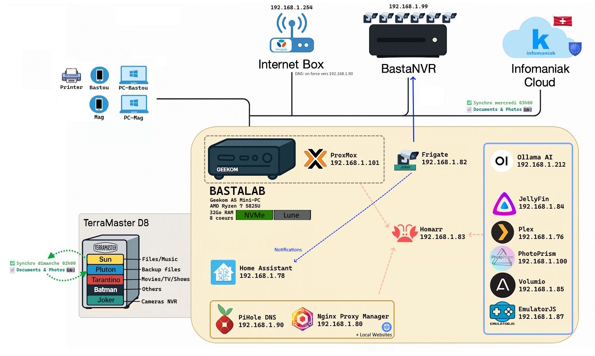

# 🌌 BASTAVERSE

### L'entrée de mon univers numérique !

 

<v-switch>

<template #1>

</template>

<template #2>

#### GIT Versionning

</template>

<template #3>
    

</template>

<template #4>

<h5 style="text-shadow: 2px 2px 4px rgba(0,0,0,0.5);">💻 IDE</h5>

Kiro.dev (bêta)

VSCode

Windsurf

Cursor

<h5 style="text-shadow: 2px 2px 4px rgba(0,0,0,0.5);">🔄 Versionning</h5>

GitHub

<h5 style="text-shadow: 2px 2px 4px rgba(0,0,0,0.5);">🗄️ BDD</h5>

PocketBase

<h5 style="text-shadow: 2px 2px 4px rgba(0,0,0,0.5);">🤖 LLM</h5>

Mammouth.ai (portail)

Claude

Mistral

ChatGPT

DeepSeek

Llama

</template>

</v-switch>

<!--
🌌 BASTAVERSE - L'ENTRÉE DE MON UNIVERS NUMÉRIQUE

🎯 Le hub central :
- BastaVerse, c'est la porte d'entrée de tout mon écosystème
- Le point de départ pour accéder à toutes mes apps
- La vitrine de mon autonomie numérique

📊 LES SLIDES :
1️⃣ SLIDE 1 - Architecture globale :
- Montrer le schéma Mermaid avec toutes les apps organisées par catégorie
- Vie quotidienne, Médias, Voyages, Dev/Réseau, Professionnel
- Tout est interconnecté !

2️⃣ SLIDE 2 - Versionning Git :
- Montrer le workflow Git professionnel
- Branches develop, features, releases
- Tags de versions sémantiques
- "Oui, même mes projets persos suivent les bonnes pratiques !"

3️⃣ SLIDE 3 - Architecture réseau :
- Montrer le schéma du réseau local
- Proxmox, VMs, containers, NAS...
- "C'est mon petit datacenter à la maison !"

4️⃣ SLIDE 4 - Stack technique :
- IDE : Kiro.dev (bêta), VSCode, Windsurf, Cursor
- Versionning : GitHub
- BDD : PocketBase
- LLM : Mammouth.ai (portail), Claude, Mistral, ChatGPT, DeepSeek, Llama

🎯 CONSEIL : Prendre le temps sur ces slides - c'est le cœur technique de la présentation !
-->