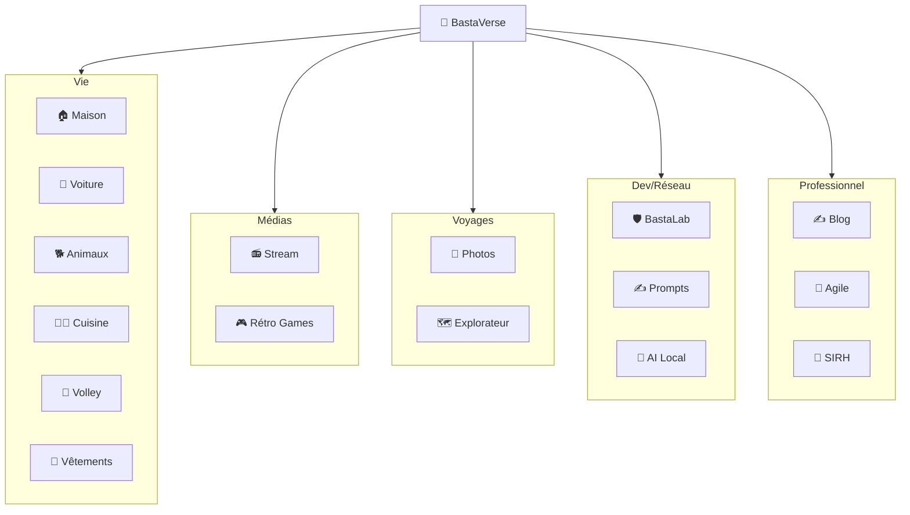
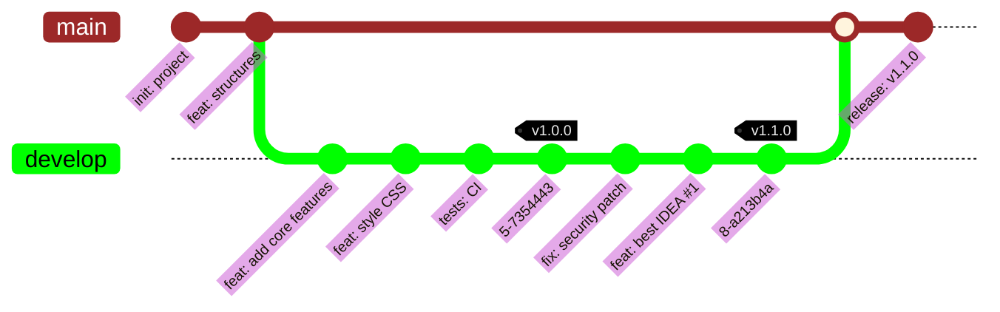

# 🌌 BASTAVERSE

### L'entrée de mon univers numérique !

 

<v-switch>

<template #1>

</template>

<template #2>

#### GIT Versionning

</template>

<template #3>
    

</template>

</v-switch>

<!--
BastaVerse, c'est le hub central qui connecte tout mon écosystème !
-->