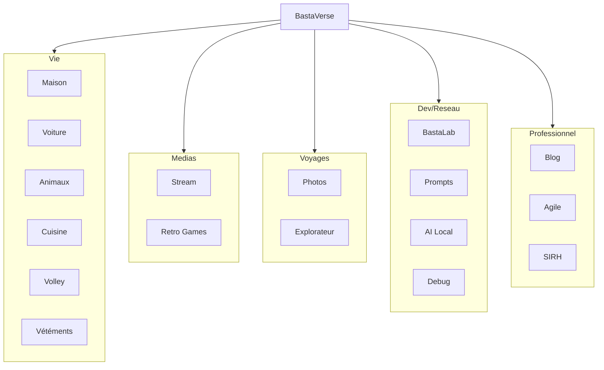

# De la catastrophe numérique au BastaVerse

### Coach Agile *(& bidouilleur)*

### Sébastien ROUEN
<!-- notes
Notes du presentateur azaz 
-->

---

<!-- layout: image-right -->

# Le déclic qui change tout

### Il y a quelques années

- **Des centaines** de photos de famille...
- Des **mois** de galère pour récupérer
- Stress intense dans le foyer
- Tristesse > Colère > Fatigue > Frustration > Résignation...

# **"Plus jamais ça !"**

---

<!-- layout: image-right -->

## Outils de récupération "miraclés"

- **Plus chers** que mon premier PC
  - EaseUS Data Recovery Wizard / Wondershare / CleverFiles / TestDisk / Recurva / ...

- **Résultats aléatoires** et décevants
  - Plus on tente de récupérer des données, plus cela devient compliqué pour le disque dur et ses index

- **Frustration maximale +++**

> **La révélation** : "Je dois faire mal les choses ! Et si j'arrêtais de subir la tech ?"

---

<!-- layout: image-right -->

# La riposte

### Mon homelab personnel

- **Premier projet** : BastaLab
- Fini de faire confiance aux nuages
- **Tout chez moi, sous contrôle !**

### Les débuts chaotiques

- Serveur qui crashait toutes les 2h...
- J'ai réinstallé 6x Proxmox
- J'ai reperdu plusieurs fois mes données en voulant "rsync"
- Docker : 5 fois mon réseau cassé
- Ma box et son DNS par défaut

---

<!-- layout: image-right -->

# L'écosystème qui émerge

## **17 applications**
## **100% d'autonomie**
## **0 EUR d'abonnement** *(sauf le cloud)*

Chaque "frustration/besoin" = un service qui devient un site local !

---

<!-- layout: image-right -->

# Photos

### Notre coffre-fort à souvenirs

- **L'accès familial** des photos
- Backup **3-2-1** automatique
  - 3 copies
  - 2 supports differents
  - 1 hors-site
- **Ma chérie adore !**

### Résultat : Plus jamais de photos perdues !

---

<!-- layout: image-right -->

# Le Carnet de l'Explorateur

## Fini les apps payantes !

- Marre des limitations
- Planning de voyages **intelligent**
  - Budgets **détaillés** par destination
  - Cartes **interactives** + météo
  - Suivi **jour** par jour
  - Carnet **imprimable**
  - Recherche intelligente de **lieu**

### Économies & adaptabilité

---

<!-- layout: iframe-right -->
<!-- url: https://maison-drafts.bastou.dev -->

# Inventaire

### *"Où ai-je mis ce truc deja ?"*

- **Inventaire intelligent** de tout
- **Localisation précise** par pièce
- **Photos** de chaque objet
- **Recherche** ultra-rapide
- **Vendre** facilement

### Cas d'usage réel

> Chérie, elle est où la tondeuse a gazon ?!?
>
> Dans le tiroir, 2eme étage
>
> ...

---

<!-- layout: image-right -->

# Carnet de voiture

### Ma voiture aussi veut du love

- **Carnet d'entretien** numérique
- **Documents** centralises
- **Rappels** automatiques
- **Suivi des coûts**

### Résultat : Plus d'oubli de revisions !

---

<!-- layout: image-right -->

# Carnet de sante pour animaux

### Tiger mérite un suivi premium !

- **Carnet de sante** numérique
- **Suivi des dépenses** vétérinaires
- **Rappels** vaccins/vermifuges
- **Journal** des événements
- **QR Code/NFC** sur collier (si perdu)

### Tiger a son dossier médical

---

<!-- layout: image-right -->

# BastaVêtements

### Fini de se re-mesurer à chaque fois !

- **Carnet de vêtements** : techniques
- **Suivi des dépenses**
- **Rappels** des tailles (EU, US, UK)

### Plus besoin de se re-mesurer à chaque fois.

---

<!-- layout: iframe-right -->
<!-- url: https://agile-drafts.bastou.dev -->

# Agile Coach Toolkit

### L'efficacité professionnelle

- **Outils rapides** et sur-mesure
- **Tableaux de bord** personnalisés
- **Accès rapide** a des infos
- **Ateliers** sans besoin de s'inscrire !!!
- **Accès** sécurisé a des ateliers

### Résultats

- Temps gagne
- Productivite accrue

---

<!-- layout: iframe-right -->
<!-- url: https://quizz-drafts.bastou.dev -->

# BastaQuizz (en construction)

### Apprendre en s'amusant !

- **Quizz personnalisés** par thématique
- **Suivi des scores** et progression
- **Classements** et badges de réussite
- **Création facile** de nouveaux quizz
- **Parfait pour animer** des séminaires

### Benefices

- Apprentissage ludique
- Mémorisation renforcée
- Motivation par le jeu

---

<!-- layout: image-right -->

# BastaCuisine

### La gourmandise organisée

- **Recettes** familiales
- **Menus** hebdomadaires
- **Quantités** modifiables

### Cas d'usage réel

*"Ou est ta recette secrété de cookies ? Ici !"*

---

<!-- layout: iframe-right -->
<!-- url: https://oldies-drafts.bastou.dev -->

# BastaRetro

## Ma salle d'arcade rétro

- **Émulation** de consoles rétro
- **Collection** de jeux classiques
- **Jouer** depuis n'importe où
- **Mode multijoueurs** local

### Nostalgie garantie !

Pac-Man, Metroid, Tetris, Street Fighter...

---

<!-- layout: image-right -->

# BastaPrompts

### Mon assistant de prompts local

- **Bibliothèque** de prompts optimisés
- **Templates** pour tous usages

### Avantages

- Rapidité
- Pratique
- Structure adaptée a mes besoins

---

<!-- layout: image-right -->

# AI Local

### Mon assistant local

- **Modèles LLM** en local (Ollama)
- **Contextes** personnalisés
- **0 dépendance** cloud

### Avantages

- Confidentialité TOTALE
- Gratuit

---

<!-- layout: iframe-right -->
<!-- url: https://volley-drafts.bastou.dev -->

# BastaVolley

## Ma **passion** sportive

- **Vitrine** des equipes
- **Random** des equipes
- **Planning** des matchs
- **Discussion** privée entre capitaines

### Résultat

Matchs équilibrés et fun garanti !

---

<!-- layout: image-right -->

# BastaBlog

### Ma vitrine professionnelle

- **Blog** personnel et pro
- **Articlés** techniques détaillés
- **Retours d'expériences** projets

### Impact business

- Visibilité
- Crédibilité
- Mémoires
- Partages

---

<!-- layout: image-right -->

# BastaStream

## Mon media center

- **Radios** du monde entier
- **Chaînes** streaming
- **Playlists** personnalisées
- **Pas de pub**

### Résultat

Mon propre media center, gratuit et sans algorithme intrusif !

---

<!-- layout: image-right -->

# Admin API

### Mon tableau de bord technique

- **Monitoring** des services
- **Métriques** en temps réel
- **Administration** centralisée
- **Alertes** et notifications

### Avantages

- Controle total
- Visibilité complété
- Réactivité maximale

---

<!-- layout: image-right -->

# BastaLab

### Mon labo d'expérimentation

- **Homelab** auto-hébergé sur Proxmox
- **VMs et containers** pour multimedia/domot.
- **Dashboard temps réel**
- **Monitoring** disques, sauvegardés, ...
- **Interface** mobile/desktop

### Avantages

- Infrastructure maîtrisée
- Documentation centralisée (FAQ)
- Surveillance proactive

---

# BastaVerse

### L'entrée de mon univers numérique !

---

# Architecture réseau

---

<!-- layout: cover -->

# Le bilan après 6 mois

- **Du jus** de cerveau
- **Beaucoup** de patience
- **17 applications** fonctionnelles
- **Autonomie** totale
- Abonnement mensuel **minime**
  - Infomaniak 2To : 193 EUR/3ans = **64 EUR/an**

### **R.O.I. en 6 mois**

---

<!-- layout: cover -->

# Ce que j'aurais aimé savoir

### Les erreurs a eviter

- **Ne pas** tout faire d'un coup
- **Commencer simple** et **itérer**
- **Backup 3-2-1** dès le début
- **Documentation** au fur et a mesure — *Écris-moi un README*
- **TROP de détails**, tue le detail

### **La perfection est l'ennemi du bien !**

---

<!-- layout: image-right -->

# Comment commencer votre révolution

- **Auditez** vos abonnements actuels
- **Identifiez** vos frustrations/besoins
- **Prototypez** un MVP en 1 weekend
- **Testez** avec de vrais utilisateurs *(vous-même deja et proches)*

### **L'important, c'est de faire le premier pas !**

---

<!-- layout: image-right -->

# Les enseignements clés

- **Vos frustrations** = vos opportunités
- **Commencer simple** et itérer
- **Vos données** vous appartiennent
- **L'autonomie** n'a pas de prix

### *"Parfois, la meilleure app, c'est celle qu'on ne trouve nulle part... alors on la crée !"*

---

<!-- layout: cover -->

# Ah oui... au fait !

## J'vous ai dit que le BastaVerse avait son hub aussi ?!

---

<!-- layout: cover -->

# Questions & Réponses

### Frustrations, remarques, conseils ? Parlons-en !

- **Questions techniques** sur l'architecture
- **Aspects économiques** et R.O.I.
- **Sécurité** et bonnes pratiques
- **Par où commencer** concrétément

---

<!-- layout: cover -->

# Merci !

*"La frustration est le carburant de l'innovation !"*

**Sébastien ROUEN** — Coach Agile & Bidouilleur

### Annexes

- [Proxmox VE Helper-Scripts](https://community-scripts.github.io/ProxmoxVE/scripts)
- [Mammouth.ai](https://mammouth.ai)
- [Claude.ai](https://claude.ai)
- [GitHub](https://github.com)
- [Geekom](https://www.geekom.fr)
