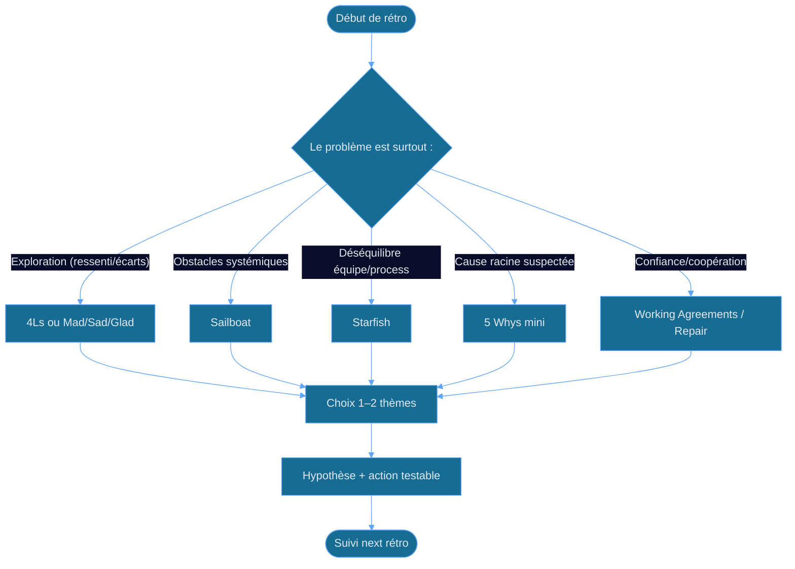

<!-- layout: cover -->
<!-- style: background: linear-gradient(135deg, #071a07 0%, #0d2e0d 50%, #1a4a1a 100%); -->

# Formats de rétrospectives 🧠
### Le bon format… au bon moment… pour débloquer vraiment
**Scrum Master · Équipes dév · Coaches agiles · Managers**

<!-- notes
Accroche : “Quand la rétros commence à tourner en rond, le problème n’est pas l’équipe… c’est souvent le format.” Puis transition : on va voir comment choisir.
-->

---

<!-- layout: image-right -->

## Pourquoi plusieurs formats ? 🎯
Une rétro n’est pas un “rituel”, c’est un *outil de diagnostic + décision*.
- 🔍 **Problème différent ⇒ technique différente** : qualité, friction, coordination, motivation…
- 🧩 **Objectif différent ⇒ format différent** : explorer, prioriser, résoudre, reconstruire la confiance
- ⚠️ **Piège** : “On fait Start/Stop/Continue” même quand le besoin est un conflit structurel
- ✅ **Bonne pratique** : choisir un format qui force la bonne conversation (et une décision testable)
> *“La rétro réussie produit un apprentissage actionnable, pas juste des ressentis.”*

<!-- notes
Question : “Quelle rétros a eu lieu récemment sans changement concret ?” Transition : on cadre les typologies.
-->

---

<!-- positions: 0:1%,11%,48%,66%,1em | 1:50%,4%,48%,93% -->
<!-- layout: image-left -->
## Typologie des problèmes 🧩
*Quel problème essaye-t-on de résoudre ?*

### 1) Constats récurrents
### 2) Fuites de valeur / inefficience
### 3) Qualité & dette technique
### 4) Tensions humaines / confiance
### 5) Décalage “plan ↔ réalité”

> Conseil terrain : commence par l’angle (exploration vs décision vs réparation).

<!-- notes
Faire expliciter un exemple vécu par l’audience. Transition : associer format↔objectif↔participants.
-->

---

<!-- layout: content -->
## Avec qui ? Pour quoi ? 📌
| Format (exemples) | Ce que ça met en lumière | Seuil d’alerte |
|---|---|---|
| 🌡️ **4Ls** (Liked/Learned/Lacked/Longed for) | apprentissages & écarts | frustration “diffuse” sans causes |
| 🧱 **Sailboat** (bateau / vent / ancre) | obstacles systémiques | “tout est bloqué” sans levier clair |
| 🕵️ **5 Whys** (ou cause racine) | causes racines | on traite les symptômes uniquement |
| 🧨 **Starfish** (5 axes) | équilibre produit/people/process | mêmes thèmes, décisions vagues |
| 🤝 **Renégociation de règles** | confiance & comportements | micro-conflits répétés, blame |

**Règle d’or :** le format doit *forcer une hypothèse* puis *un test*.

> *“Pas de “parler pour parler” : chaque format prépare une décision.”*

<!-- notes
Insister : “si c’est humain, il faut traiter humain ; si c’est système, il faut traiter système.” Transition : un mapping pratique.
-->

---

<!-- positions: 0:13%,2%,75%,55%,1em | 1:35%,62%,32%,36%,0.93em -->
<!-- layout: image-right -->

## Mapping rapide : format ↔ besoin ✅
- 🔎 **Explorer & clarifier** : 4Ls, Mad/Sad/Glad (selon contexte)
- 🧭 **Créer une trajectoire** : Sailboat, Starfish (équilibrage)
- 🧪 **Chercher une cause** : 5 Whys, Ishikawa *en mini* (focus)
- 🤝 **Réparer le collectif** : “Working Agreements”, check-in émotionnel cadré
- 📐 **Aligner plan ↔ réalité** : rétros basées sur des événements (incidents, lead time)

> Conseil terrain : si l’atelier dérape, reviens à l’axe “décision/test”.

<!-- notes
Demander : “Quel besoin vous décrit le plus ?” Transition : détailler une méthode fiable étape par étape.
-->

---

<!-- positions: 0:0%,0%,43% | 1:43%,2%,55%,93% -->
<!-- layout: image-left -->
## Déroulé standard (adaptable) 🧰
*Un template qui garde le cap, quel que soit le format.*

### 1) Cadre & sécurité (2–3 min)
### 2) Collecte (10–15 min)
### 3) Regroupement & choix (10 min)
### 4) Hypothèse + test (10 min)
### 5) Engagement & suivi (2–5 min)

> Conseil terrain : limiter à **1–2 actions max** (sinon, rien ne tient).

<!-- notes
Mettre l’accent sur la sécurité et l’hypothèse. Transition : diagramme du “process” de sélection du format.
-->

---

<!-- positions: 0:6%,2%,88% | 1:3%,11%,92%,68% | 2:6%,77%,88% | 3:6%,85%,88% -->
<!-- layout: content -->
## Diagramme de décision 🧭

**Règle d’or :** si tu ne peux pas écrire un *test*, le format n’était pas le bon.

> *“Un format est un levier de pensée, pas un décor.”*

<!-- notes
Guide : “la question = le problème dominant”. Transition : comparaison des formats dans un cas typique.
-->

---

<!-- positions: 0:6%,11%,88% | 1:5%,23%,86%,47% -->
<!-- class: comparison-slide -->
## Ce que la rétro “insensible” change vraiment

❌ Ce qui détruit la valeur

<ul>
<li>Rebrasser des ressentis sans hypothèse</li>
<li>Actions trop nombreuses → aucune appliquée</li>
<li>Blâme individuel déguisé en “amélioration”</li>
</ul>

✅ Ce qui fait la différence

<ul>
<li>Format adapté au problème (système vs humain)</li>
<li>Décision en 1–2 tests concrets</li>
<li>Suivi visible (précédent vs nouveau)</li>
<li>Cadre de sécurité + écoute active</li>
</ul>

<!-- notes
Relier à l’expérience : “quand c’est ‘insensible’, c’est souvent un mauvais angle.” Transition : exemples de cas.
-->

---

<!-- positions: 0:1%,0%,74%,53% | 1:57%,49%,41%,49%,0.95em -->
<!-- layout: image-right -->

## Cas pratique #1 : “On perd du temps” ⏳
*Équipe : dév + QA, cycles de livraison irréguliers.*
- 🔍 **Symptôme** : lead time ↑, retours tardifs
- 🧩 **Format recommandé** : Sailboat (vent = causes externes, ancre = contraintes)
- ⚠️ **Piège** : parler uniquement process “idéel” sans données (incidents, latences)
- ✅ **Bonne pratique** : finir par une hypothèse testable (ex : “qualité à l’amont”)
> Conseil : commence par “où ça ralentit, pas par “qui est lent””.

<!-- notes
Faire imaginer : “vent vs ancre”. Transition : un cas humain plus délicat.
-->

---

<!-- positions: 0:0%,3%,33%,44% | 1:34%,1%,64%,96% -->
<!-- layout: image-left -->
## Cas pratique #2 : “Tensions dans l’équipe” 🤝
*Équipe : merge conflicts, reproches, fatigue.*

### Format : Repair + Working Agreements
1. Check-in cadré (ressenti sans accusation)
2. Comportements observables (pas intentions)
3. 1–2 accords *(ex : “definition of done partagée”, “revue PR en SLA”)*

> Conseil terrain : si la confiance est basse, garde l’action à l’échelle comportementale (pas “culture”).

<!-- notes
Mettre en garde : “ne pas lancer 5 Whys sur une plaie ouverte”. Transition : cas compliqué multi-équipes.
-->

---

<!-- positions: 0:6%,11%,88% | 1:6%,26%,88% | 2:6%,51%,88% | 3:6%,61%,88% -->
<!-- layout: content -->
## Cas pratique #3 : multi-équipes & dépendances 🔗
| 🚧 Problème | 🧐 Pourquoi c’est compliqué ? | ✅ Format qui aide |
|---------|----------------------------|------------------|
| Délais cassés par une autre équipe | Blâme inter-équipes, “pas de pouvoir” | Sailboat + Engagement explicite |
| Qualité hétérogène entre services | Définitions du “Done” divergentes | Working Agreements / Starfish |
| Décisions non suivies | Actions “décoratives” | Timebox + Action “owner + évidence” |

**Règle d’or :** si vous ne contrôlez pas le levier, reformulez l’objectif en *influence* testable.

> *“On ne promet pas l’impossible : on teste ce qu’on peut changer.”*

<!-- notes
Insister sur “owner + evidence”. Transition : slide code pour structurer une action test.
-->

---

<!-- positions: 0:1%,5%,76%,93%,0.98em | 1:60%,14%,38%,50% | 0/0:3%,3%,94%,18% -->
<!-- layout: image-right -->

## Action testable : modèle simple 🧪

### Objectif (1 phrase) : réduire X de Y d’ici Z

- Hypothèse : si nous faisons A, alors B changera car ...
- Expérimentation : durée (ex : 1 sprint), modalités, owner
- Indicateur : mesure avant/après (ex : lead time p90)
- Risque : ce qui peut casser + plan de secours

→ **Interprétation** :
si amélioration < seuil : ajuster l’hypothèse, sinon standardiser

✅ **Toujours** : “owner + indicateur + durée”
❌ **Jamais** : une action sans mesure ni moyen de vérifier

<!-- notes
Donner un exemple : “délais = p90 lead time”. Transition : montrer comment la rétros évolue avec la maturité.
-->

---

<!-- layout: content -->
## Quand changer de format ? ⏫
| Évolution | Ce qui se passe | Indice | Prochain format |
|---|---|---|---|
| Début d’agilité | beaucoup de friction “nouveau” | bruit > thèmes | 4Ls (apprentissage) |
| Stabilisation | répétition des mêmes causes | mêmes “top 3” | 5 Whys mini |
| Problèmes systémiques | obstacles persistants | ancrage “politique/scope” | Sailboat |
| Confiance fluctuante | émotions prennent le dessus | blame implicite | Repair / Working Agreements |

**Règle d’or :** le format suit la maturité, pas l’habitude.

> *“L’habitude fatigue l’équipe, le format la guide.”*

<!-- notes
Question : “Votre équipe est-elle en exploration ou en résolution ?” Transition : sources & ouverture.
-->

---

<!-- positions: 0:2%,23%,38%,47%,0.97em | 1:42%,5%,57%,88% -->
<!-- layout: image-left -->
## Pièges fréquents (et antidotes) ⚠️

### 1) Faux consensus
### 2) Actions trop vagues
### 3) Domination de 1–2 voix
### 4) Pas de suivi réel
> Antidote : timebox + vote pondéré + retour “qu’est-ce qu’on a appris / changé ?”.

### Sources & inspirations 📚
miroverse, draft.io, Claude Aubry, Pablo Pernot…

<!-- notes
Inciter à chercher des variantes : “pièges = mauvais design d’atelier”. Transition : wrap-up et CTA.
-->

---

<!-- layout: cover -->
<!-- style: background: linear-gradient(135deg, #071a07 0%, #0d2e0d 50%, #1a4a1a 100%); -->

# Et maintenant ? ✅
## Quelle est la première chose que vous allez changer ?
**Scrum Master · Coach agile · Manager**

📌 *Choisissez un format pour un problème précis — puis écrivez 1 test avec un indicateur.*

<!-- notes
Conclusion : proposer un engagement immédiat. Exemple : “prochaine rétros, quel format et quelle hypothèse test ?”. -->
