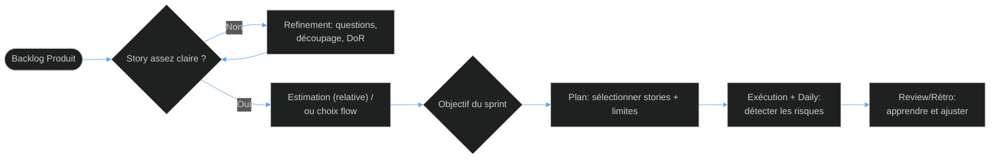

<!-- layout: cover -->

# L’estimation en Agile 🧭
### Pourquoi estimer… et quand “no estimate” devient une bonne décision ?
**Scrum Master & Équipe de dév · Session 15 min**

<!-- notes
Posez la question : “Quand vous estimez, vous cherchez la précision ou la collaboration ?”
Annoncez que le but est d’expliquer les options (estimate / no estimate), les pièges et un mini cas pratique.
-->

---

<!-- layout: image-right -->

## Estimation Agile : de quoi parle-t-on ? 🎯
- 🔍 **Estimer = prévoir l’effort / la complexité** pour planifier intelligemment
- 🧩 **Objectif Scrum = améliorer la prévisibilité**, pas “deviner le futur”
- ⚠️ **Piège : confondre effort et durée** (les deux ne bougent pas pareil)
- ✅ **Focus : rendre le travail “discutable”** pour l’équipe

> *“On estime pour décider ensemble.”*

<!-- notes
Reliez “estimation” à un outil de discussion : clarifier, aligner, réduire l’incertitude.
-->

---

<!-- positions: 0:0%,16%,41%,69%,1em | 1:42%,4%,56%,90% -->
<!-- layout: image-left -->
## Le problème que Scrum veut résoudre 🧠
*Pourquoi l’estimation existe dans les sprints ?*


### 1) Prioriser 💡
Choisir quoi livrer en premier avec un effort “relatif”
### 2) Construire un plan 🗺️
Former un sprint backlog réaliste
### 3) Communiquer 📣
Partager une capacité attendue de l’équipe

> Conseil terrain : “Si ça ne sert pas à décider, on simplifie.”

<!-- notes
Faites émerger une douleur : “On ne sait pas ce qu’on peut faire en sprint.”
-->

---

<!-- positions: 0:1%,14%,49%,73% | 1:53%,13%,45%,71%,1em -->
<!-- layout: image-right -->

## Estimation vs Mesure 📏
- 🔍 **Estimation (relative)** : on compare (Story Points, T-shirt sizing)
- 🧩 **Mesure (réelle)** : on observe (burndown, throughput, cycle time)
- ⚠️ **Piège : “chasser la précision”** → leads to faux engagements
- ✅ **Bonne pratique : utiliser l’historique** pour calibrer

> *“Prédire moins, apprendre plus.”*

<!-- notes
Soulignez que l’estimation peut être remplacée par le flux (Kanban) si l’organisation s’y prête.
-->

---

<!-- layout: content -->
## Les méthodes d’estimation les plus courantes 🧰
| Méthode | Ce que ça mesure | Quand l’utiliser |
|---------|------------------|------------------|
| **Story Points** | Effort/complexité relatif | Scrum & amélioration continue |
| **T-shirt sizing** | Taille grossière | Pour cadrer vite au début |
| **Planning poker** | Alignement via discussion | Éviter l’estimation solitaire |
| **Décomposition** | Risque/efforts mieux visibles | Quand une story est trop floue |

**Règle d’or :** une estimation doit déclencher une meilleure compréhension, pas un débat stérile.

> *“Le résultat utile, c’est l’apprentissage.”*

<!-- notes
Guidez : “Choisissez une méthode adaptée au niveau de clarté du backlog.”
-->

---

<!-- positions: 0:1%,24%,36%,46%,0.98em | 1:37%,6%,63%,88%,1em -->
<!-- layout: image-left -->
## Story Points : ce qu’on met dedans ✅


### 🧱 Effort relatif
Temps “typique” à niveau de complexité comparable
### 🔧 Complexité
Technique, intégration, dépendances
### 🧨 Incertitude/risque
“À quel point on n’est pas sûrs ?”
### 👥 Capacité de l’équipe
Estimation faite par ceux qui feront le travail

> Conseil : évitez de “monter” les points pour compenser un manque de clarifications.

<!-- notes
Clarifiez une confusion fréquente : points = effort/complexité, pas uniquement du temps.
-->

---

<!-- positions: 0:1%,6%,48%,90%,1em | 1:49%,13%,49%,67%,1em -->
<!-- layout: image-right -->

## Comment se passe un Planning Poker ? 🎴
- 🔍 **Préparer** : story claire, critères d’acceptation, questions ouvertes
- 🧩 **Simuler** : chacun joue une carte sans être influencé
- ⚠️ **Piège : argumenter “pour gagner”** au lieu de clarifier
- ✅ **Bonne pratique : discussion uniquement sur les écarts**

> *“La carte est la base, la conversation est le produit.”*

<!-- notes
Insistez sur la gestion des écarts : “Pourquoi cette valeur ? Qu’est-ce qui manque ?”
-->

---

<!-- layout: content -->
## Estimer pour améliorer la prévisibilité 📈
| Signal | Ce que ça raconte | Seuil d’alerte |
|--------|---------------------|------------------|
| **Forte dérive** (replanif répétée) | Estimations trop optimistes | Story Points ≠ effort réel |
| **Points “gonflés”** | Trop d’incertitude non adressée | Les points deviennent politiques |
| **Problèmes récurrents** | Décomposition insuffisante | Beaucoup de “unexpected work” |
| **Taux de variation** | Niveau de stabilité du système | Trop de variance de delivery |

**Règle d’or :** si ça dérive, ajuste le backlog, pas la “négociation” des points.

> *“Prévoir n’est pas promettre.”*

<!-- notes
Liez à l’inspection/adaptation : rétrospective + actions concrètes.
-->

---

<!-- layout: image-left -->
## Différentes équipes, mêmes principes… ⚙️


### Équipe experte 🔥
Points stables, focus sur détails & risques
### Équipe en montée en compétences 🌱
Augmenter le pairing, préciser “Definition of Ready”
### Équipe avec dépendances 🧩
Ajouter “spikes”, découper par intégration
### Équipe multi-produits 🧭
Cadencer les estimations selon l’intervalle de décision

> Conseil : adaptez la technique à votre niveau d’incertitude.

<!-- notes
Demandez : “Votre équipe est plutôt experte, en apprentissage, ou sous forte dépendance ?” Transition vers le “no estimate”.
-->

---

<!-- class: comparison-slide -->
## Ce que “No Estimate” change vraiment 🧪
<div class='comp-wrap'>
<div class='comp-col comp-before'>
<div class='comp-head'>❌ Ce qui détruit la valeur</div>
<ul>
<li>Estimation gardée comme “contrat”</li>
<li>Débats sans critères d’acceptation</li>
<li>Points utilisés pour pression / blame</li>
</ul>
</div>
<div class='comp-col comp-after'>
<div class='comp-head'>✅ Ce qui fait la différence</div>
<ul>
<li>Décisions via flux (cycle time, throughput)</li>
<li>Transparence sur ce qui bloque</li>
<li>Amélioration continue par données</li>
<li>Moins de temps “rituel”, plus de livraison</li>
</ul>
</div>
</div>

> *“On remplace le ‘pari’ par l’observation.”*

<!-- notes
Expliquez que “no estimate” n’est pas “no planning” : on planifie autrement (flux/limites/WIP).
-->

---

<!-- layout: image-right -->
## No estimate : modèle mental simple ✅

- 🔍 **On supprime les estimations détaillées** (points pour chaque story)
- 🧩 **On utilise des métriques de flow** (cycle time, WIP, throughput)
- ⚠️ **Piège : vouloir juste “arrêter”** sans remplacer par des règles
- ✅ **Bonne pratique : limiter le WIP + clarifier DoR/DoD**

> Conseil : démarrez petit, testez 1-2 sprints, puis ajustez.

<!-- notes
Donnez l’idée : si on ne mesure rien, no estimate devient du “non pilotage”.
-->

---

<!-- positions: 0:2%,24%,28%,39%,1em | 1:31%,2%,68%,96%,1em -->
<!-- layout: image-left -->
## Cas pratique (mini) : Estimer une story 🎲
*On a une user story “Requêtes API + pagination”*  


### Étape 1 — Questions (2 min)
- Quels endpoints ?
- Quelles performances attendues ?
### Étape 2 — Risques (2 min)
- Cache ? limites ? auth ?
### Étape 3 — Estimation relative (3 min)
- Choisir une taille (S/M/L ou Story Points)
### Étape 4 — Accord (1 min)
- Détails à ajouter pour réduire l’incertitude

> *“Si vous ne pouvez pas poser de questions, la story n’est pas prête.”*

<!-- notes
Faites participer : demandez au public d’identifier 2 questions et 1 risque.
-->

---

<!-- positions: 0:3%,9%,93%,12% | 1:7%,20%,85%,90%,1em | 2:6%,132%,88% | 3:6%,137%,88% -->
<!-- layout: code -->
## Cas pratique (suite) : corriger une mauvaise estimation 🛠️

```text
Sprint plan: 20 SP
Réalité: ~10 SP livrés

Hypothèses:
- story trop grosse (manque de découpage)
- dépendance non visible (test/staging)
- critères d’acceptation incomplets

→ Action:
1) Décomposer en 2-3 stories
2) Ajouter DoR explicite
3) Prévoir un spike sur la dépendance
```
- Point clé : on améliore le “process” qui produit les estimations
- Ce qu’on ne fait JAMAIS : changer les points après coup pour “justifier”

<!-- notes
Transition : passer à une approche plus structurée (flow/sequence) pour visualiser l’enchaînement.
-->

---

<!-- layout: content -->
## Séquence “saine” avant de s’engager 🔁
| Moment | Entrée | Sortie |
|--------|--------|--------|
| **Refinement** | Story + contexte | Questions & découpage |
| **Estimation** | Clarté suffisante | Points consensuels |
| **Sprint Planning** | Capacité dispo | Sprint Backlog réaliste |
| **Daily** | Risques visibles | Réduction des blocages |
| **Review/Rétro** | Données réelles | Actions d’amélioration |

**Règle d’or :** “On estime quand on sait assez pour réduire l’incertitude.”

> *“La qualité du backlog pilote la qualité des estimations.”*

<!-- notes
Insistez sur la continuité : refinement → estimation → exécution → inspection.
-->

---

<!-- positions: 0:6%,11%,88% | 1:4%,24%,91%,47%,1em | 2:6%,80%,88% -->
<!-- layout: content -->
## Diagramme : du backlog au choix d’engagement 🧩



> Synthèse : l’estimation est un “garde-fou” de compréhension, pas une prévision exacte.

<!-- notes
Annoncez : selon le contexte, on peut basculer de “points” vers “flow”, mais le cycle d’apprentissage reste identique.
-->

---

<!-- layout: cover -->

# Et maintenant ? 🚀
## Quelle est la première chose que vous allez changer ?
**Scrum Master & équipe · Prochaine action en 48h**
📚 *Ressource : commencez par vos DoR/DoD + un test Planning Poker (ou no estimate) sur 1 sprint*

<!-- notes
Clôturez par une question d’engagement : “Changez quoi dès le prochain refinement ?”
Suggérez une action concrète : clarifier DoR, limiter le WIP ou améliorer le découpage.
-->
