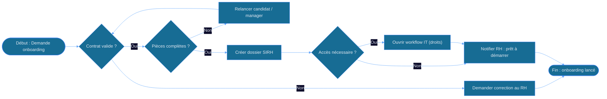
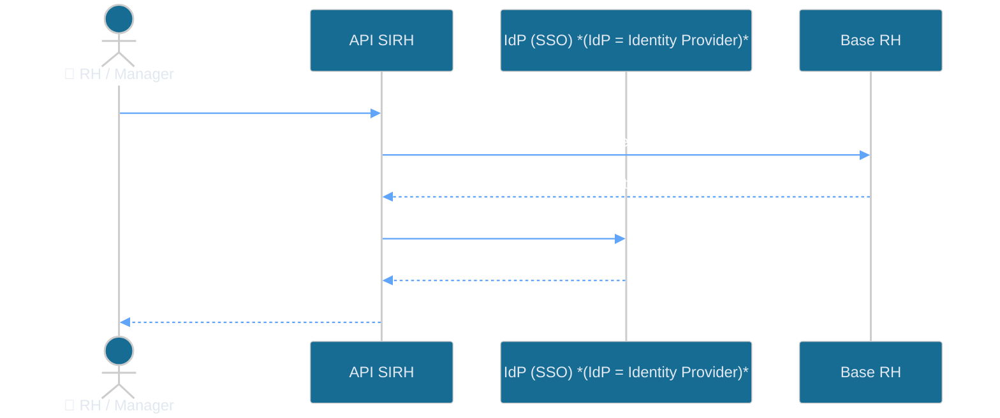
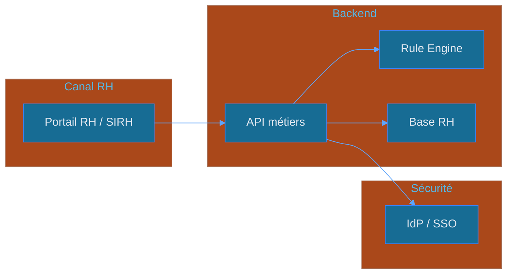

<!-- layout: cover -->
<!-- style: background: linear-gradient(135deg, #071a07 0%, #0d2e0d 50%, #1a4a1a 100%); -->

# Logigramme & diagramme 🧭
### Comprendre les différences… et les appliquer au SIRH
**Contexte · Pour équipes SIRH & pilotage**

<!-- notes
Accroche : “Aujourd’hui, vous allez arrêter de dessiner au hasard.” Question : “Quel schéma utilisez-vous pour décrire un processus RH… et pourquoi ?”
-->

---

<!-- layout: image-right -->

## Les 4 mots qui se mélangent 🎯
- 🔍 **Logigramme** : décrit un *enchaînement d’actions* (décisions incluses)
- 🧩 **Diagramme** : cadre visuel pour *représenter un modèle* (flux, relations, étapes)
- 🧱 **Schéma** : terme large = *structure* (organisation, architecture, composants)
- ⚠️ **Piège** : même “forme”, usages différents selon l’objectif
> *Règle d’or : le but du schéma dicte la forme, pas l’inverse.*

<!-- notes
Transition : “On va clarifier le vocabulaire avec des cas SIRH.” Mentionner : “À la fin, vous saurez quoi utiliser pour : onboarding, contrôles, intégrations, reporting.”
-->

---

<!-- layout: image-left -->
## Logigramme ✅ vs Diagramme (modèle)
*Vous voulez décrire un “process” ou un “modèle” ?*

### Logigramme 🧾
- Étapes **séquentielles**
- Conditions **OUI/NON**
- Traçabilité **process**
### Diagramme 🧠
- Structures **relationnelles**
- Cas d’usage **conceptuels**
- Cartographie **des objets**
> Conseil terrain : “si vous pouvez dire ‘et ensuite…’, c’est probablement un logigramme.”

<!-- notes
Question : “Quand vous lisez vos schémas, est-ce qu’on peut suivre une histoire chronologique ?” Dire que la slide suivante formalise ça avec une table.
-->

---

<!-- positions: 0:6%,11%,88% | 1:2%,23%,96%,42%,1em | 2:6%,74%,88% -->
<!-- layout: content -->
## Quand utiliser quoi ? (SIRH) 📌
| Besoin SIRH | Meilleure représentation | Seuil d’alerte |
|---------|-----------------------------|------------------|
| Décrire un processus (contrôle, décision, validation) | **Logigramme** | Si trop de “relations” => trop complexe |
| Montrer des composants / intégration (API, SI, DB) | **Schéma d’architecture** | Si on met des conditions métiers partout |
| Relier concepts (poste↔compétence↔formation) | **Diagramme (entités/relations)** | Si on confond temps et liens |
| Lancer un pilotage (KPI, règles, monitoring) | **Diagramme de flux + métriques** | Si on oublie les indicateurs |

**Règle d’or :** *Processus = logique de décision ; Modèle = relations ; Architecture = composants.*

<!-- notes
Accroche : “Vous pilotez des équipes, pas des cases.” Transition : “On va voir les formes + symboles à ne pas confondre.”
-->

---

<!-- positions: 0:2%,4%,74%,55% | 1:60%,54%,38%,46%,0.96em -->
<!-- layout: image-right -->

## Les formes (symboles) à connaître 🧩
- 🔍 **Début/Fin** : pour cadrer le périmètre (“on entre / on sort”)
- ◆ **Processus/Opération** : action métier (ex : “Vérifier éligibilité”)
- ◇ **Décision** : embranchement (ex : “KYC valide ?”)
- → **Flèches** : direction + logique de lecture
- ⚠️ **Piège SIRH** : flèches sans nom = ambigu (pas de “pourquoi”)
> *Bonne pratique : une phrase = une boîte.*

<!-- notes
Dire : “Chaque fois que vous mettez une boîte sans verbe, le schéma perd sa valeur.” Préparer le cas “onboarding”.
-->

---

<!-- positions: 0:1%,0%,43% | 1:45%,8%,50%,81%,1em -->
<!-- layout: image-left -->
## Cas pratique #1 : Onboarding employé 👤➡️🏁
*Décrire le flux de décision : contrat, pièces, validations…*

### Logigramme : pourquoi ?
- 🔒 Réduit les oublis de pièces & validations
- 📍 Aligne RH, SIRH, IT sur le “qui décide quoi”
- 🧯 Détecte les boucles (retours de service)
> Conseil : ajoutez un “chef d’orchestre” par étape critique.

<!-- notes
Transition : “Passons au Mermaid : même logique, mais exécutable mentalement.”
-->

---

<!-- positions: 0:3%,2%,77%,15% | 1:2%,13%,96%,74% | 2:2%,89%,53%,8%,0.98em -->
<!-- layout: content -->
## 🧾 Onboarding : Logigramme



> *Synthèse : en SIRH, les décisions (◇) cadrent la conformité.*

<!-- notes
Accroche : “Cherchez les décisions ◇ : elles révèlent les contrôles.” Transition : “Maintenant, on passe à un cas d’intégration (architecture).”
-->

---

<!-- layout: image-right -->

## Cas pratique #2 : Intégration SI 🔌
*Vous décrivez un processus… ou une architecture ?*
- 🔍 **Architecture** : “qui parle à qui” (API, SI, SI RH)
- 🧩 **Intégration** : contrats de données, synchronisation, erreurs
- ⚠️ **Piège** : mettre des conditions métiers dans une vue technique
- ✅ **Bonne pratique** : 2 vues séparées (technique vs métier)
> Règle : *architecture = composants ; logigramme = décisions métiers.*

<!-- notes
Prévoir : une slide “comparaison” pour clarifier les dégâts causés par le mauvais choix.
-->

---

<!-- positions: 0:6%,11%,88% | 1:5%,20%,88%,47%,1em -->
<!-- class: comparison-slide -->
## Ce que le “mauvais schéma” change vraiment ⚠️
<div class='comp-wrap'>
<div class='comp-col comp-before'>
<div class='comp-head'>❌ Un logigramme utilisé pour l’architecture</div>
<ul>
<li>Lisibilité technique faible</li>
<li>Étapes confondues avec composants</li>
<li>Scalabilité impossible à maintenir</li>
</ul>
</div>
<div class='comp-col comp-after'>
<div class='comp-head'>✅ Architecture claire (schéma de composants)</div>
<ul>
<li>Responsabilités explicites</li>
<li>Intégrations traçables (API/DB)</li>
<li>Gestion des incidents plus rapide</li>
<li>Base pour monitoring & SLA</li>
</ul>
</div>
</div>

<!-- notes
Demander : “Dans vos projets, qu’est-ce qui a le plus ralenti : confusion, oubli, ou validation tardive ?” Transition vers un diagramme d’interactions.
-->

---

<!-- positions: 0:6%,1%,88% | 1:7%,12%,86%,60%,1em | 2:6%,75%,88%,12% | 3:6%,88%,88% -->
<!-- layout: content -->
## Intégration : diagramme de séquence (Mermaid) ⏱️


> **Légende** : *IdP (SSO)* = *Identity Provider* (fournisseur d’identité) responsable de l’authentification et du SSO, ainsi que de la création/validation des accès.  

> *Synthèse : la séquence rend visibles les latences et points d’échec.*

<!-- notes
Transition : “On va maintenant traiter les ‘formes’ visuelles au niveau pilotage et cohérence documentaire.”
-->

---

<!-- positions: 0:0%,17%,43%,62%,1em | 1:44%,5%,53%,91% | 0/0:2%,9%,94%,75% -->
<!-- layout: image-left -->
## Schémas & pilotage 📊 : le bon niveau d’abstraction
*Votre audience : RH, DSI, contrôle de gestion… ?*

### Pour RH 👥
- Vue **process** + responsabilités
### Pour DSI/IT 🧑‍💻
- Vue **architecture** + intégrations
### Pour pilotage 📈
- Vue **indicateurs** + conformité
> Conseil : 1 schéma par question → pas 1 schéma pour tout.

<!-- notes
Accroche : “Le même sujet change selon l’objectif.” Transition : tableau de métriques pour “qualité de schéma” et “qualité de processus”.
-->

---

<!-- layout: content -->
## Métriques utiles pour “discipliner” vos schémas ✅
| Objet | Ce que ça mesure | Seuil d’alerte |
|---------|---------------------|-----------------|
| <span style="color:#22c55e;">Clarté de décision</span> | % décisions sans critère explicite | <span style="color:#f97316;">&gt; 10% = dérive</span> |
| <span style="color:#22c55e;">Traçabilité</span> | % étapes reliées à une responsabilité | <span style="color:#f97316;">&lt; 80% = flou</span> |
| <span style="color:#22c55e;">Couverture contrôles</span> | % contrôles présents dans le flux | <span style="color:#f97316;">&lt; 100% = risque conformité</span> |
| <span style="color:#22c55e;">Dette documentaire</span> | “schémas obsolètes” vs version SI | <span style="color:#f97316;">dès qu’on le sait : déjà trop tard</span> |

> **Règle d’or :** *Un schéma doit être vérifiable et mis à jour avec le SI.*

<!-- notes
Transition : “Maintenant : un mini ‘template’ code-like pour standardiser la logique (sans outillage lourd).”
-->

---

<!-- positions: 0:2%,14%,52%,72% | 1:56%,5%,43%,94% -->
<!-- layout: image-right -->

## Standardisez la logique 🧱 (checklist rapide)

```
Nommer chaque boîte : Verbe + Objet

Ex: "Valider éligibilité" / "Mettre à jour statut"
Décisions : critère mesurable + source de vérité
Traçabilité : Qui agit ? Quel système ?
Erreurs : chemin explicite (fallback / retry)

→ Résultat : un schéma “audit-ready”
```
- <span style="color:#22c55e">Point clé</span> : évitez les boîtes “magiques” (sans critère)
- Ce qu’on ne fait <span style="color:#ef4444">JAMAIS</span> : décision “OK” sans règle

<!-- notes
Accroche : “Vous pouvez appliquer ça même sans diagramme formel.” Transition : architecture d’un SIRH.
-->

---

<!-- positions: 0:6%,11%,88% | 1:6%,26%,88% | 2:6%,80%,88% -->
<!-- layout: content -->
## Architecture SIRH : exemple (Mermaid) 🏗️

> *Synthèse : l’architecture montre les composants ; pas la logique métier fine.*

<!-- notes
Transition : “Pour former les équipes, une vue pédagogique vaut mieux qu’un ‘tout en un’.” Préparer la slide “pour qui / qui fait quoi”.
-->

---

<!-- positions: 0:1%,23%,41%,56%,1em | 1:42%,1%,56%,94% | 1/0:2%,12%,96%,8% | 1/1:2%,22%,96%,6% | 1/2:2%,31%,96%,4% | 1/3:2%,35%,96%,4% | 1/4:2%,42%,96%,4% | 1/5:2%,46%,96%,4% | 1/6:2%,52%,96%,4% | 1/7:2%,56%,96%,4% | 1/8:2%,63%,96%,4% | 1/9:2%,66%,95%,20%,0.99em -->
<!-- layout: image-left -->
## 👥 Rôles & usages

#### Pour qui dessiner ?

#### Pilotage / HR Ops
- logigrammes + indicateurs

#### Projets SIRH / PMO
- diagrammes de périmètre + risques

#### DSI / Intégration
- architecture + séquences

#### Contrôle interne / Audit
- vues “audit-ready” + règles de décision
> Conseil : une matrice “schéma ↔ audience ↔ usage” évite la friction.


<!-- notes
Transition : donner une méthode en 3 étapes et finir par une couverture “CTA”.
-->

---

<!-- positions: 0:0%,0%,36%,99%,1em | 1:37%,18%,57%,63% -->
<!-- layout: image-left -->


## Méthode en 3 étapes

🧠 **Étape 1** : formulez la question "Qu’est-ce qui déclenche… ?"
🧩 **Étape 2** : choisissez la forme (logigramme/diagramme/schéma/architecture)
📌 **Étape 3** : validez avec l’audience (RH, IT, pilotage, ...)

> *Règle : si l’audience ne peut pas répondre après lecture, le schéma est à refaire.*

<!-- notes
Accroche : “Avant de conclure : on compare un dernier cas métier à un autre.” Préparer une timeline ou diagramme stats.
-->

---

<!-- positions: 0:6%,11%,88% | 1:7%,20%,85%,59%,1em | 2:6%,80%,88% -->
<!-- layout: content -->
## Évolution d’un workflow : timeline 🗓️

```mermaid
%%{init: {'theme': 'dark'}}%%
timeline
    title Montée en maturité des workflows SIRH
    2024 : Cartographie macro (vision globale, peu exploitable)
    2025 : Intégration des décisions & des rôles (début du pilotage)
    2026 : Dissociation des vues (processus vs architecture SI)
    2026+ : Schémas versionnés, auditables et alignés conformité
```

> *Synthèse : la qualité vient de la version, pas de la perfection du dessin.*

<!-- notes
Transition : dernier chapitre “à vous” + CTA pour agir immédiatement.
-->

---

<!-- layout: cover -->
<!-- style: background: linear-gradient(135deg, #071a07 0%, #0d2e0d 50%, #1a4a1a 100%); -->

# Et maintenant ? 🚀
## Quelle est la première chose que vous allez changer ?
**Équipe SIRH · Direction & Pilotage**
📚 *Suggestion : créez une “fiche choix” (question → forme) pour standardiser vos schémas.*

<!-- notes
Clôture : inviter l’audience à choisir un schéma existant et le “re-catégoriser” (process vs modèle vs architecture). Merci + Q/R.
-->
