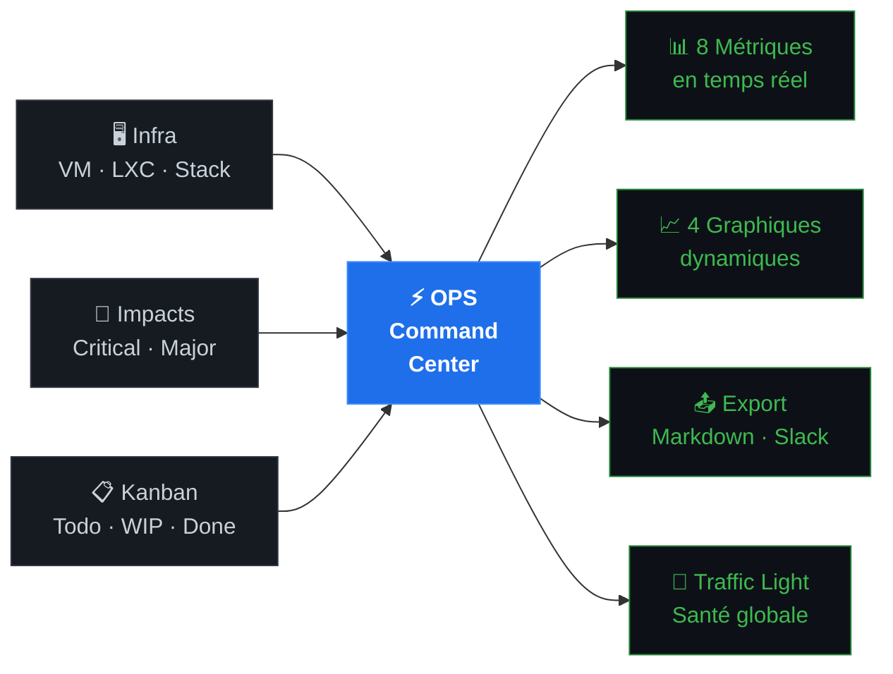

<!-- layout: cover -->
<!-- style: background: linear-gradient(135deg, #0a0a0f 0%, #0d1117 40%, #1a1f2e 100%); -->

# ⚡ OPS Command Center


### Un tableau de bord de pilotage OPS — 100% local, zéro dépendance

<!-- notes
Accroche : "Combien de fois avez-vous dû jongler entre 5 onglets différents pendant un incident ?"
Présenter le contexte : journée d'innovation, besoin concret des OPS au quotidien.
-->

---

<!-- layout: image-right -->

## Le problème du quotidien OPS


### Pendant un incident, vous avez besoin de :

- 🖥️ **Savoir quelles machines** sont en vie — ou pas
- 🔴 **Déclarer et suivre** un impact utilisateur
- 📋 **Coordonner les tâches** de l'équipe en temps réel
- 📤 **Communiquer** : Slack, Teams, e-mail... vite

> **Sans outil centralisé** → stress, perte de temps, informations dispersées

<!-- notes
Insister sur la réalité vécue : pendant un incident critique, on ne peut pas se permettre de chercher l'info.
Mentionner le ressenti : fatigue cognitive, erreurs de communication, "qui fait quoi ?".
-->

---

<!-- layout: content -->
<!-- style: background: linear-gradient(160deg, #0d1117, #1a1f2e); -->

## ⚡ Ce que fait l'OPS Command Center



<!-- notes
Montrer le schéma et expliquer les 3 entrées (ce qu'on alimente) et les 4 sorties (ce qu'on obtient).
C'est simple : on entre des données, le dashboard fait le reste.
-->

---

<!-- positions: 0:2%,18%,39%,54% | 1:40%,1%,59%,95% -->
<!-- layout: image-left -->

## Les fonctionnalités clés


| Fonctionnalité | Valeur |
|----------------|--------|
| 🚦 **Traffic Light** | Statut global en 1 coup d'œil |
| 🖥️ **Inventaire infra** | Statut cyclable up/degraded/down |
| 📋 **Kanban intégré** | Priorisation et assignation des tâches |
| 🔴 **Gestion d'impacts** | Sévérité, origine, timeline |
| 📈 **4 graphiques** | Activité, statuts, priorités, incidents |
| 📤 **Export communiqué** | Markdown ou Slack en 1 clic |
| 🔒 **100% local** | Aucune donnée ne quitte le navigateur |

<!-- notes
Insister sur le Traffic Light : c'est l'indicateur central, visible en 1 seconde.
Le 100% local est un argument fort pour la sécurité et la souveraineté des données.
-->

---

<!-- layout: content -->
<!-- style: background: linear-gradient(160deg, #0d1117, #161b22); -->

## 🏆 La plus-value démontrée

### Ce que cette journée d'innovation a produit

<br>

| Avant | Après |
|-------|-------|
| 5+ onglets ouverts pendant un incident | **1 seul écran**, tout centralisé |
| Statut infra dispersé dans des wikis | **Mise à jour en 1 clic**, visible de tous |
| Communiqué rédigé à la main | **Généré automatiquement** (Markdown / Slack) |
| "C'est qui qui gère ça ?" | **Kanban visible** par toute l'équipe |
| Diagnostic long et stressant | **Traffic Light** : rouge / jaune / vert instantané |

> 💡 **Résultat** : moins de stress, meilleure coordination, communication plus rapide

<!-- notes
Ancrer dans le concret : combien de minutes gagnées sur un incident ?
Mentionner que le dashboard a été conçu en 1 journée d'innovation → preuve que c'est faisable rapidement.
Si dispo : montrer une démo live avec le bouton "Scénario incident".
-->

---

<!-- positions: 0:6%,0%,43% | 1:51%,11%,43% -->
<!-- layout: image-right -->

## 🔜 Ce qui reste à faire


### Objectif : installation en salle OPS

- [x] ~~Dashboard fonctionnel~~ ✅
- [x] ~~Scénarios de démo~~ ✅
- [x] ~~Export Slack / Markdown~~ ✅
- [ ] **Brancher sur un ordi local** dans la salle OPS
- [ ] **Configurer les endpoints API** (GitLab, GitHub, Prometheus...)
- [ ] **Importer l'inventaire infra** réel (machines, IP, statuts)
- [ ] **Paramétrer les canaux** de communication (Slack `#ops-incidents`, etc.)
- [ ] **Affichage permanent** sur écran dédié (mode compact 🖥️)

> **Effort estimé** : ~1j pour une mise en route complète

<!-- notes
Insister sur la simplicité d'installation : pas de serveur, pas de déploiement.
Il suffit d'ouvrir index.html dans un navigateur.
L'étape critique = configurer les endpoints API pour avoir de la donnée réelle.
-->

---

<!-- layout: section -->
<!-- style: background: linear-gradient(135deg, #0a0f1a, #0d1f3c); -->

# Prochaine étape

## Installer le dashboard dans la salle OPS

```bash
# Installation en 30 secondes
git clone https://github.com/sebastien-rouen/ops-command-center.git
cd ops-command-center
open index.html   # ou double-clic → c'est tout !
```

### Pas de serveur · Pas de déploiement · Pas de npm

**Qui prend la main pour l'install ?** 🙋

<!-- notes
Appel à l'action concret : qui dans la salle est volontaire pour installer ça ?
Rappeler que c'est open source, MIT, libre de modification.
Laisser du temps pour les questions.
-->
