# Processus d'Engagement

## Notre approche en 4 étapes

```mermaid
graph LR
    A[🔍 Diagnostic] --> B[🎯 Co-création]
    B --> C[🚀 Mise en œuvre]
    C --> D[📈 Mesure d'impact]
    
    style A fill:#FF6B35,stroke:#2E3440,color:#fff
    style B fill:#88C0D0,stroke:#2E3440,color:#fff
    style C fill:#A3BE8C,stroke:#2E3440,color:#fff
    style D fill:#EBCB8B,stroke:#2E3440,color:#2E3440
```

  

    <OctoBadge variant="primary" size="lg">1</OctoBadge>
    <h4 class="font-semibold mt-2">Diagnostic</h4>
    
Analyse des besoins

  

  

    <OctoBadge variant="accent" size="lg">2</OctoBadge>
    <h4 class="font-semibold mt-2">Co-création</h4>
    
Solutions collaboratives

  

  

    <OctoBadge variant="success" size="lg">3</OctoBadge>
    <h4 class="font-semibold mt-2">Mise en œuvre</h4>
    
Accompagnement terrain

  

  

    <OctoBadge variant="warning" size="lg">4</OctoBadge>
    <h4 class="font-semibold mt-2">Mesure</h4>
    
Impact et amélioration

  

